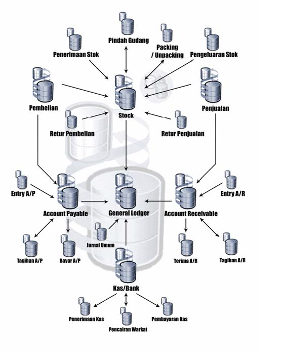
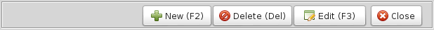
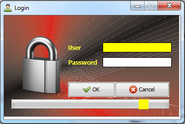
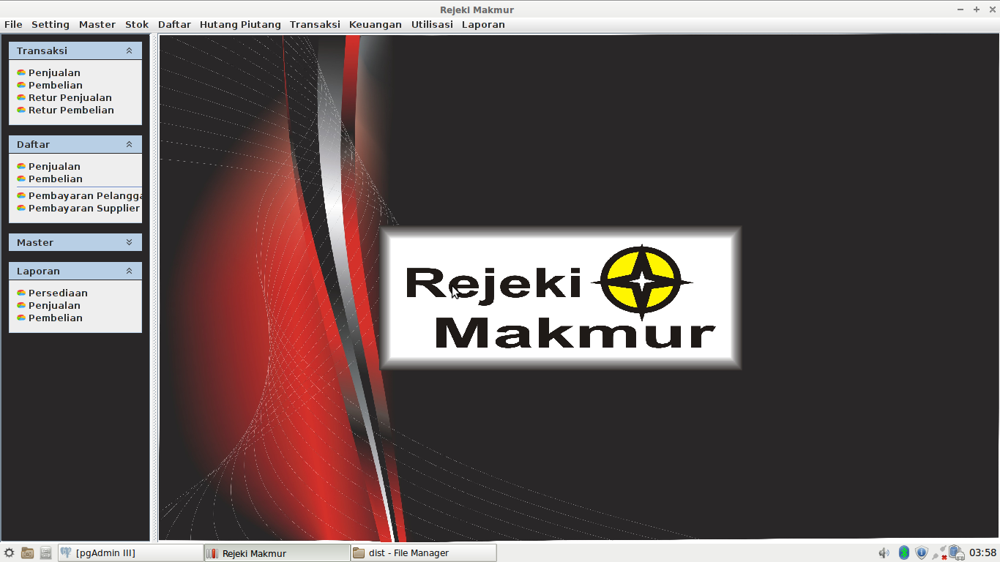
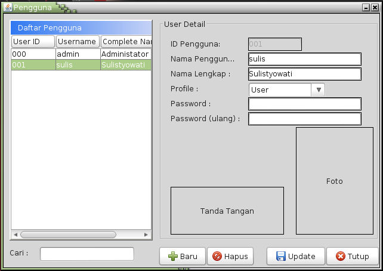
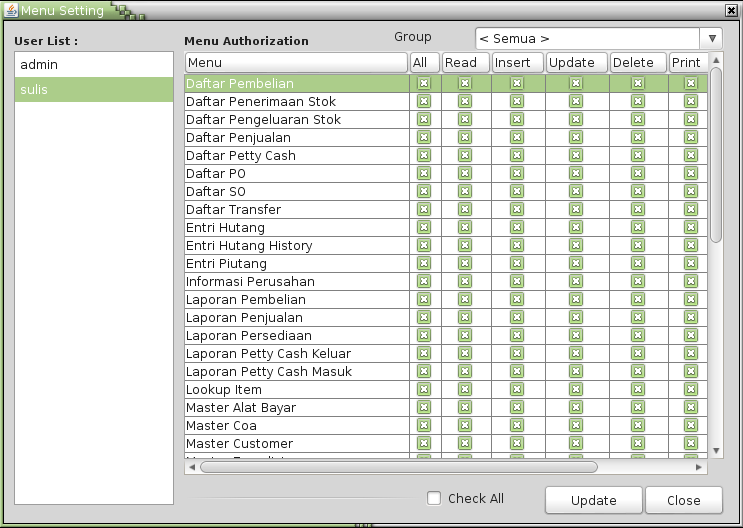
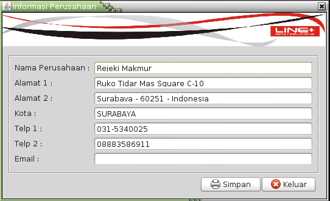

# PENDAHULUAN #

Dalam mengelola kegiatan bisnis yang begitu luas dan cepat, membuat kita membutuhkan suatu alat yang dapat membantu dalam menangani masalah ini.
Teknologi sistem informasi adalah salah satu solusi yang digunakan sebagian besar kegiatan bisnis dagang, jasa, pendidikan, rumah sakit dan lain-lan.  

SIM-RM merupakan Sistem Informasi Penjualan dan Akuntansi merupakan program yang mencakup transaksi yang berhubungan dengan mengelola stok, proses pembelian, penjualan sampai proses pencatatan akuntansi dan keuangan  yang khusus dibuat untuk Rejeki Makmur Surabaya.  
Program ini dibangun dengan menyesuaikan kebutuhan perusahaan dan dapat dikembangkan sendiri jika suatu saat ada perubahan *bussines process* atau penambahan fitur lain.

##Sekilas Tentang Program Aplikasi

SIM-RM merupakan program aplikasi bisnis terintegrasi yang berarti semua bagian program SIM-RM saling berhubungan antara satu dengan yang lain. 
Dari semua hubungan diatas, Parameter merupakan bagian terpenting dalam hubungan tersebut. Banyak hubungan antar bagian ini ditentukan dalam Parameter. 
Hampir semua transaksi mempunyai hubungan dengan General Ledger dalam bentuk jurnal yang secara otomatis diposting.  

Hubungan tersebut dapat digambarkan sebagai berikut :

\newpage

* **Transaksi Stok**

> Semua transaksi dalam Stok akan secara otomatis membuat jurnal (General Ledger) sesuai dengan kode akun “Persediaan” yang ditentukan dalam Master Stok, 
> Kode Akun yang diberikan atau juga Parameter. Selain itu, Transaksi Stok juga mempengaruhi saldo stok sesuai dengan Kode Stok, Gudang dan Satuan stok barang.

* **Transaksi Pembelian**

> Transaksi pembelian secara langsung merubah/mempengaruhi General Ledger, Stok (Saldo Stok) dan Hutang (Account Payable). Karena SIM-RM
> mengunakan metode perpetual dalam akuntansi persediaan, maka Pembelian akan membuat jurnal sesuai dengan kode akun stok dalam Master
> Stok dan kode akun sesuai dengan Master Supplier. Untuk retur pembelian, akun yang dipergunakan untuk membuat jurnal adalah kode akun stok dalam
> Master Stok dan kode akun dalam Master Supplier juga. Pembelian akan menambah jumlah stok barang dan Retur Pembelian akan
> mengurangi Stok Barang. Stok barang yang ditambah maupun dikurangi adalah berdasarkan Kode Stock, Kode Gudang dan Satuan barang dalam
> transaksi. Transaksi Pembelian barang secara otomatis akan menimbulkan Hutang Dagang (Account Payable atau A/P, sedangkan Transaksi Retur
> Pembelian Pembelian sebaliknya akan menimbulkan Piutang Dagang (Account Receiveble atau A/R). Hutang dan Piutang Dagang ini kemudian
> dapat disatukan (di-cross) pada modul Hutang & Piutang. 

* **Transaksi Penjualan**

> Sama seperti Pembelian, Penjualan juga akan merubah/mempengaruhi General Ledger, Stok dan Piutang Dagang (Account Receivable). Penjualan
> akan membuat jurnal penjualan dan jurnal harga pokok. Jurnal penjualan dibentuk sesuai dengan kode akun “Penjualan” pada Master stok serta kode
> akun pada Master Customer. Sedangkan jurnal harga pokok disusun berdasarkan kode akun “Harga Pokok” dan kode akun “Persediaan” dalam
> Master Stok. Sedangkan retur penjualan akan membentuk jurnal sesuai dengan kode akun “Retur Penjualan” pada Master Stok serta kode akun pada
> Master Customer. Retur penjualan juga akan membuat jurnal harga pokok dengan kode akun “Harga Pokok” dan “Persediaan” dari Master Stok.
> Penjualan dan Retur Penjualan juga akan mempengaruhi Saldo Stok sesuai dengan Kode Stock, Gudang dan Satuan stok.
> Transaksi Penjualan akan menimbulkan Piutang Dagang (Account Receivable atau A/R), sebaliknya Retur Penjualan akan menimbulkan
> Hutang Dagang (Account Payable atau A/P). Hutang Dagang dan Piutang Dagang ini selanjutnya akan ditangani dalam modul Hutang & Piutang

* **Transaksi Hutang (Account Payable atau A/P)**

> Transaksi Hutang dapat berasal dari Hutang Dagang dari Modul Pembelian ataupun Hutang yang dientry dalam modul Hutang (A/P) dan juga dari
> Transaksi Retur Penjualan pada Modul Penjualan. Dari tiga menu transaksi dalam modul Hutang, hanya Entry Hutang dan Pembayaran Hutang yang
> mempunyai pengaruh ke modul Kas dan General Ledger. 

* **Transaksi Piutang (Account Receivable atau A/R)**

Sama seperti Hutang, transaksi Piutang berasal dari Piutang Dagang dari Modul Penjualan maupun yang dientry sendiri dalam modul Piutang (A/R)
dan juga dari Transaksi Retur Pembelian. Entry yang mempunyai pengaruh terhadap modul Kas dan General Ledger adalah Entry Piutang dan Penerimaan Piutang.

* **Transaksi Kas**

> Data Transaksi Kas dapat berasal dari modul A/P dan A/R serta dapat juga dientry sendiri dalam modul Kas. Transaksi Kas secara otomatis akan
> diposting dalam General Ledger untuk setiap transaksi yang dientry. Kode akun jurnal dipengaruhi oleh Kode Kas/Bank, Tipe Alat Bayar serta Kode
> Relasi (Customer maupun Supplier) dalam transaksi tersebut.

* **Jurnal General Ledger**

> Dari penjelasan diatas, General Ledger menerima data dari berbagai transaksi. Pada kenyataannya modul General Ledger merupakan modul
> terakhir yang hanya menampung data / menerima data dari data transaksi lainnya. Secara umum, jurnal umum hanya untuk membuat beberapa
> transaksi yang bersifat penyesuaian dan transaksi-transaksi yang belum mempunyai modul tersendiri dalam sistem ini.

**Teknologi**

Untuk membangung sistem ini, kami menggunakan teknologi sebagai berikut:

- **PostgreSQL** : Digunakan untuk Database Management System
- **JavaSE** : Sebagai antarmuka pengguna
- **JasperReport** : Digunakan untuk membuat laporan

Arsitektur yang dipakai adalah *client-server*, dimana Data diletakkan di satu komputer (server) dan bisa diakses oleh lebih dari satu user. Database server hanya diinstall disatu 
komputer saja, sedangkan untuk aplikasi *client* hanya diinstall aplikasi Java saja.

Program ini bisa berjalan dengan *multi-platform* sehingga bisa diinstall dan dijalankan di Sistem Operasi Windows, Linux dan lain-lain, sehingga bisa menghemat biaya lisesnsi
Windows dan Sistem Operasi berbayar lainnya.

Komputer yang digunakan untuk server bisa dipisahkan dengan komputer tersendiri atau jadi satu dengan aplikasi client.

##Cara kerja dan mempelajari panduan ini##

Ada beberapa hal yang harus dipahami sebelum membaca buku ini, terutama berhubungan dengan kebiasaan teknis dalam pengoperasian komputer seperti

* **klik**		: menekan tombol mouse kiri satu kali;
* **klik mouse kanan**	: menekan tombol mouse kanan satu kali;
* **klik ganda/ _double-click_**	: menekan tombol mouse kiri 2 kali dengan cepat-cepat;
* **drag**		: menekan tombol mouse kiri dengan tidak melepaskan lalu menggeser (menggerakkan) mouse ke arah lainnya (atas, bawah, 
kiri, kanan atau samping);
* **icon**		: tombol berbentuk gambar yang mewakili suatu perintah, dimana saat ikon tersebut diklik maka akan muncul *form input*. berikutnya;
* **kotak dialog**	: suatu form isian yang perlu diisikan suatu informasi;
* **tombol**		: tombol perintah untuk mengeksekusi kotak dialog seperti tombol OK, Yes, Next, Print, Preview dan lainnya;
\
Beberapa form di program ini mempunyai perilaku yang hampir sama untuk menambah, mengedit dan menghapus data. Untuk melakukan hal ini, kita bisa menekan tombol yang terdapat dibagian kanan form seperti gambar berikut

##Memulai Program##

Untuk memulai menjalankan program, maka anda bisa klik ganda pada icon program POS yang sudah disediakan di halaman depan (_desktop_) komputer anda, 
atau bisa juga dengan klik ganda di folder tempat program POS (misal: D:/ProgramJava/POS/dist/RM-POS.jar), maka halaman pertama yang kita jumpai adalah Login User seperti gambar berikut

Masukkan username dan password yang anda miliki kemudian tekan enter atau klik OK untuk melanjutkan ke halaman utama dari program ini.\
Jika validasi nama anda dan password sesuai, maka selanjutnya akan ditampilkan halaman utama dari program SIM ini seperti gambar berikut:

Pada halaman utama program SIM-RM terdiri dari beberapa bagian, yaitu menu dibagian atas, *taskpane menu* dibagian kiri dan Panel Desktop dibagian tengah.
Anda bisa mengakses aktifitas dari program dengan klik menu dibagian atas maupun pada menu *task-pane*. dibagian kiri menu utama.  

Pada menu atas, dikelompokkan berdasarkan aktifitas transaksi Apotek, yang terdiri dari :

* **File**	: yang terdiri dari menu *User Management*. untuk mengelola pengguna yang diperbolehkan untuk mengakses program ini, ubah password 
user yang sedang login, logout dan keluar dari program 
* **Master**	: menu Master, digunakan untuk melakukan persiapan data master sebelum aktifitas transaksi dilakukan. Master ini meliputi master barang, jenis barang, group barang, Supplier, Jenis Supplier, Satuan dan lain lain.
* **Persediaan** : digunakan untuk melakukan transaksi penambahan/ mengurangi stok, antara lain dengan Stok Opname, Transfer Antar Gudang, Penerimaan Barang Lainnya, Pengeluaran Barang Lainnya.
* **Pembelian** : terdiri dari *purchase requisition - PR*., *purchase order - PO*, *Good Receipt*./ Penerimaan Barang, *PO-Cash*., Retur Pembelian
* **Penjualan**, terdiri dari aktifitas penjualan resep, retur penjualan, pembayaran piutang
* **Laporan**, terdiri dari laporan kasir, penjualan, pembelian dan laporan persediaan

###Manajemen User/ Pengguna

User/ pengguna adalah hal yang paling utama, karena data user ini memungkinkan seseorang untuk bisa mengakses program ini.  
Untuk mengelola data user/ pengguna program klil menu Setting --> Pengguna, maka form manajemen user akan ditampilkan seperti gambar dibawah.

Untuk menambahkan user baru, tekan tombol **Baru**, Id pengguna ditampilkan kosong, akan tetapi pada saat disimpan otomatis akan diisi oleh sistem dengan 3 digit angka.
Isikan username - harus *unique* yang belum pernah dipakai oleh user lainnya, nama lengkap, profile pengguna (Administrator, Supervisor atau user biasa), kemudian isikan password user.  
Pada saat membuat user baru password bisa diisikan dengan "12345" atau password lain yang mudah diingat, setelah user tersebut login maka dia bisa mengubah password tersebut dengan password yang diinginkan.  
Setelah semua *field*/ kolom data terisi tekan tombol **simpan**  

Untuk mengubah user yang sudah pernah dibuat, klik pada baris nama user tersebut, kemudian disebelah kanan tabel ditampilkan detail user tersebut. Ubahlah data sesuai yang diinginkan, kemudian tekan **Update** untuk menyimpan perubahan data user tersebut.  

Menghapus user juga bisa dilakukan dengan memilih terlebih dulu pada baris user yang dimaksud, kemudian tekan **Delete**. Sebelum data benar-benar dihapus, maka akan muncul konfirmasi "Apakah user akan dihapus ?", tekan **Yes** untuk menghapus user tersebut dari daftar pengguna aplikasi.

###Otorisasi Menu###

Untuk mengkustomisasi hak-hak pengguna didalam program ini, kita bisa setting dari menu Setting --> Menu Otorisasi. Form untuk mensetting otorisasi menu bisa dilihat seperti gambar dibawah 

Klik pada nama user yang akan kita setting, kemudian pada sebelah kanan daftar user, terdapat tabel yang menampilkan daftar menu yang ada di program aplikasi ini.
Klasifikasi hak akses per menu adalah *Read* (bisa melihat saja), *Insert* (bisa menambahkan data baru), *Update* (bisa mengubah data yang sudah ada), *Delete* (bisa menghapus data yang sebelumnya sudah ada).  
Akan tetapi, jika pada menu ini boleh melakukan ke empat hal tersebut, maka centang saja pada kolom *All*

###Setting Informasi Perusahaan

Sebelum memulai aktifitas terutama membuat transaksi, pastikan bahwa informasi tentang perusahaan sudah disetting dengan benar. Untuk memastikan hal ini, dari menu Setting --> Informasi Perusahaan, maka akan ditampilkan informasi perusahaan seperti gambar dibawah. Tekan save untuk menyimpan perubahan informasi perusahaan.

Ubah data alamat, telepon, dan field lain yang akan ubah, kemudian tekan **Simpan** untuk menyimpan update informasi perusahaan.

\newpage

