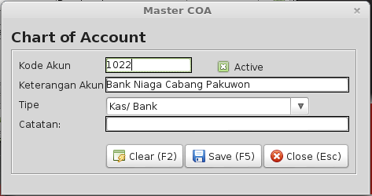

# MASTER DATA #

Untuk dapat menggunakan program aplikasi, hal pertama yang harus
dilakukan adalah menyusun tabel-tabel master. Tabel master dalam Program ini terdiri dari: 

- Chart of Account (COA)
- Account Laba Rugi
- Kas / Bank
- Tipe Alat Bayar
- Ketegori Stok
- Gudang
- Stok
- Supplier
- Customer
- Salesman
- Parameter

Data yang diperlukan untuk tabel diatas harus dipersiapkan terlebih dahulu sebelum dimasukkan dalam komputer. 
Pemasukan data juga harus berurutan sesuai dengan urutan daftar diatas, yaitu dari COA, Account Laba Rugi dan seterusnya hingga Parameter. 
Hal ini dikarenakan beberapa data yang diperlukan mempunyai hubungan dengan table master sebelumnya. Misalkan dalam Stok perlu menetapkan kategori
persediaan tersebut, sehingga tabel kategori harus diisi terlebih dahulu.
Demikian juga dengan Kas / Bank yang perlu mengidentifikasikan kode akun dari COA.

##COA ( Chart Of Account )

Chart of Account (COA) disebut juga daftar akun yang merupakan kumpulan entity atau perkiraan yang digunakan dalam pembukuan. 
Setiap akuntansi mempunyai tempat dalam kelompok-kelompok perkiraan. Kelompok perkiraan utama dalam akuntansi adalah kelompok Aset (Aktiva), 
Hutang dan Modal (Capital). Aset biasanya masih dibagi atas beberapa kelompok lebih kecil seperti Aset Lancar (Aktiva Lancar), Aset Tetap (Aktiva Tetap)
dan Aset Lainnya (Aktiva Lainnya). Hutang dibagi atas Hutang Lancar dan Hutang Jangka Panjang, sedangkan Modal (Capital) terdiri dari Modal
Disetor dan Laba Rugi Ditahan (Retain Earning). Dalam SIM-RM pengelompokan ini disebut Tipe Akun yang sudah ditentukan sedemikian rupa sesuai dengan kebutuhan akuntasi secara umum.  
Selain itu, pengelompokan akun yang lain adalah Group Neraca dan Group Laba Rugi yang keduanya berfungsi untuk melakukan grouping (pengelompokan) saat
membentuk laporan Neraca (bagi Group Neraca) dan Laporan Laba Rugi (bagi Group Laba Rugi).  
Untuk menampilkan daftar COA yang sudah diinput, klik menu Master -- COA, maka akan dimunculkan gambar seperti berikut.  

* Tambah COA

> Dari daftar COA, klik tombol **Baru**, maka akan muncul form penambahan COA baru. Isikan kode Akun, keterangan akun dan kategori akun
> Pastikan *checkbox* Active tercentang, kemudian tekan **Simpan** untuk menyimpan data COA baru.

* Ubah COA

> Mengubah COA yang sudah ada bisa dilakukan dari daftar COA, kemudian tekan **Edit**.

##Account Laba Rugi

##Master Kas Bank

##Tipe Alat Bayar

Dalam dunia usaha saat ini terdapat berbagai tipe alat bayar selain daripada uang Tunai. Beberapa dari tipe alat bayar ini ada yang langsung dapat
digunakan, ada juga yang harus melalui proses pencairan atau menunggu waktu jatuh tempo. Dalam sistem ini Tipe Alat Bayar dapat Anda
defenisikan sesuai dengan kebutuhan, kondisi perusahaan Anda.  

* Tambah Tipe Alat Bayar

> Menambahkan alat bayar bisa dilakukan dari form daftar Tipe Alat Bayar yang diakses dari menu Master --> Tipe Alat Bayar. Dari form tersebut, klik tombol **Baru**, 
> kemudian isikan kode Tipe Alat Bayar dan Nama Tipe Alat Bayar. *Checkbox* Langsung cair dicentang, jika jeni alat bayar tersebut adalah langsung cair.

* Ubah Tipe Alat Bayar

> Mengubah Tipe Alat Bayar yang sudah pernah dimasukkan dilakukan dari form daftar Tipe Alat Bayar, kemudian langsung isikan perubahan field Kode ataupun 
> Nama Tipe Alat Bayar, atau *checkbox* langsung cair kemudian langsung tekan **Simpan** untuk menyimpan perubahan Tipe Alat Bayar.

* Hapus Tipe Alat Bayar

> Tipe Alat Bayar yang tidak dipakai bisa dihapus dari form daftar Tipe Alat Bayar, dengan terlebih dulu klik baris data yang akan dihapus kemudian tekan **Delete**
> untuk menghapus. Sebelum data benar-benar dihapus, akan ada konfirmasi "Apakah data akan dihapus?", maka tekan *Yes* untuk memastikan penghapusan data tersebut.

##Kategori

Untuk bagian Inventory Control dalam program ini terdapat file-file Master Stock, Master Ketegori stok dan Master Gudang. Hal pertama yang harus 
didefenisikan dari ketiga file master tersebut adalah Kategori.  
Kategori digunakan untuk mengelompokkan persediaan barang, sehingga mempermudah dalam pengelompokan persediaan untuk analisa penjualan, pembelian, 
stok akhir dan lain-lain.   
Untuk memasukkan dan melihat kategori apa saja yang sudah dimasukkan di sistem, klik menu Master --> Kategori Stok, maka akan muncul seperti gambar dibawah.

* Tambah Kategori

> Klik tombol **Baru** atau tekan tombol **F2** di keyboard, kemudian isikan nama kategori, keterangan (jika diperlukan), dan akun default untuk 
> kategori stok tersebut. Default akun akan otomatis diisikan seperti ini, pada saat kita membuat Master Stok baru.  
> Klik **Simpan** atau tekan tombol **F2** untuk menyimpan master kategori baru tersebut.  
 

* Ubah Kategori

> Mengubah kategori yang sudah ada juga bisa dilakukan dari daftar master kategori tersebut dengan klik pada baris kategori yang akan diedit, kemudian tekan **Edit** > atau tekan tombol **F3**, maka akan ditampilkan detail dari kategori tersebut. Ubah data kategori tersebut kemudian tekan **Simpan** untuk menyimpan update kategori.  

* Hapus Kategori

> Menghapus daftar kategori juga bisa dilakukan dari daftar master kategori ini juga, yakni dengan klik baris kategori yang akan dihapus kemudian tekan tombol 
> **Delete** atau tekan tombol **Del** di komputer. Sebelum data kategori benar-benar dihapus, maka akan muncul konfirmasi penghapusan  "Apakah data benar 
> akan dihapus?", tekan *Yes* untuk menghapus master kategori tersebut.

##Gudang

Gudang adalah salah satu data yang paling penting dalam sistem inventori. Dalam sistem ini, minimal harus ada satu master gudang yang diinput.
Gudang dalam pengertian sesungguhkan dapat berbentuk Toko, Showroom ataupun lokasi tertentu yang perlu Anda pisahkan sebagai suatu tempat penyimpanan barang.  

* Tambah Gudang

> Tekan menu Master --> Gudang, Isikan Nama Gudang, Lokasi dan Keterangan (jika diperlukan), kemudian tekan **Simpan**.

* Ubah Gudang

> Pada form Master Gudang, klik pada baris nama gudang yang akan diubah kemudian ubah data pada Nama Gudang atau Lokasi dan Keterangan, kemudian tekan **Simpan**
> untuk menyimpan perubahan data Gudang.

* Hapus Gudang

> Hapus master Gudang bisa dilakukan dari form Master Gudang, kemudian klik data gudang yang akan dihapus, kemudian tekan **Delete**. Konfirmasi "Apakah benar data
> gudang akan dihapus?". Tekan *Yes* untuk memastikan bahwa data tersebut benar akan dihapus.

##Satuan

Satuan adalah salah satu hal yang paling penting sebelum kita membuat master stok/ persediaan. Pada sistem ini sengaja kita akan buat master Satuan, supaya memudahkan 
kita dalam membuat master Stok, dan agar data satuan item stok kita lebih seragam.

* Tambah Satuan

> Tekan menu Master --> Satuan, Isikan Nama Satuan dan Keterangan (jika diperlukan), kemudian tekan **Simpan**.

* Ubah Satuan

> Pada form Master Satuan, klik pada baris satuan yang akan diubah kemudian ubah data pada Nama Satuan dan atau Keterangan, kemudian tekan **Simpan**
> untuk menyimpan perubahan data Satuan.

* Hapus Satuan

> Hapus master Satuan bisa dilakukan dari form Master Satuan, kemudian klik data satuan yang akan dihapus, kemudian tekan **Delete**. Konfirmasi "Apakah benar data
> satuan akan dihapus?". Tekan *Yes* untuk memastikan bahwa data tersebut benar akan dihapus.

##Master Supplier

Supplier merupakan pihak luar yang berhubungan dengan perusahaan dalam transaksi Pembelian persediaan barang. Dalam transaksi pembukuan (Hutang
dan General Ledger) supplier biasanya ditempatkan di posisi Hutang Dagang.

* Tambah Supplier

> Sebelum menambahkan supplier baru ada baiknya kita cek dulu dari daftar supplier, apakah data tersebut sebelumnya sudah ada atau belum. Kalau belum ada, 
> maka klik tombol **Baru**, maka form entrian supplier baru akan ditampilkan seperti gambar dibawah.  

> Lengkapi field yang terdapat di form supplier tersebut antara lain nama, alamat, kota dan informasi kontak lainnya.
> Akun supplier harus diisi supaya pada saat terjadi transaksi pembelian kredit, jurnal akan otomatis memposting sesuai dengan akun hutang tersebut.
> Jika semua sudah terisi maka klik **Simpan** untuk menyimpan data baru tersebut.

* Ubah Supplier

> Pada form daftar supplier, double klik pada baris supplier yang akan diubah atau tekan tombol **Update** data tersebut, maka akan ditampilkan form Ubah Supplier.
> ubahkan isi atau field data supplier tersebut, kemudian tekan **Simpan** untuk menyimpan perubahan data supplier.

* Hapus Supplier

> Hapus master Supplier bisa dilakukan dari form daftar supplier, kemudian klik data supplier yang akan dihapus, kemudian tekan **Delete**. 
> Konfirmasi "Apakah benar data akan dihapus?". Tekan *Yes* untuk memastikan bahwa data tersebut benar akan dihapus.

##Master Stok

Master Stok merupakan daftar Item Persediaan Barang yang akan digunakan oleh sistem ini dalam semua transaksi yang berhubungan dengan persediaan
barang seperti Pembelian, Penjualan, Penerimaan Barang, Pengeluaran Barang dan berbagai transaksi lainnya.  
Untuk menampilkan daftar item yang sudah ada di sistem, pilih menu Master --> Stok atau dari menu taskpane Master sebelah kiri klik Stok. 
Daftar stok bisa difilter dengan memasukkan penggalan kata dari nama stok yang akan kita cari, maka ditabel daftar stok akan dimunculkan nama stok atau 
kategori barang yang mengandung penggalan kata tersebut. Klik tombol Refresh untuk menampilkan semua stok lagi.  

* Tambah MasterStok

> Sebelum menambahkan stok baru ada baiknya kita cek dulu dari daftar stok, apakah data tersebut sebelumnya sudah ada atau belum. Kalau belum ada, 
> maka klik tombol **Baru**, maka form entrian stok baru akan ditampilkan seperti gambar dibawah.  

> Pada form tersebut terdapat beberapa field yang harus diisi antara lain:  
> * **ID** : Sebagai kunci primer dari stok tersebut dan otomatis diisi oleh sistem  
> * **Kode** : Kode harus diisi oleh user secara manual, biasanya ada aturan tertentu untuk pengkodean stok berdasarkan kategori.  
> * **Nama Stok** : Deskripsi atau nama dari stok/ item yang digunakan yang dicetak di faktur penjualan, pembelian dan transaksi stok lainnya. Satuan harus terlebih dulu di tambahkan di Master Satuan supaya bisa digunakan di Master Stok Ini.  
> * **Satuan** : Satuan dari stok tersebut. Karena di Rejeki Makmur hanya menggunakan satu satuan saja, maka tidak ada konversi antar satuan yang harus diisi  
> * **Barcode** : Diisi jika item tersebut mempunyai *barcode* pada kemasannya.  
> * **Kategori** : Digunakan untuk mengelompokkan stok berdasarkan kategori tertentu, supaya kita mudah dalam menganalisa dan membuat rekap item berdasarkan kelompok stok tertentu.  
> * **Harga Jual** : Harga default yang ditampilkan pada saat transaksi penjualan barang, jika pelanggan tersebut belum pernah terjadi transaksi penjualan.  
> * **Tipe** : Meskipun master ini kita istilahkan dengan stok, tapi tetap saja kita bisa menambahkan item lain selain persediaan. Oleh karena itu  
> disistem ini kita bisa kategorikan stok menjadi :   
>   * Inventory : Jika item tersebut adalah persediaan dan dijurnal sebagai persediaan  
>   * Non Inventori : Item tersebut merupakan persediaan tapi akan dijurnal sebagai biaya (misalkan tas plastik yang digunakan sebagai bungkus di Supermarket).  
>   * Jasa : Item yang tidak berwujud tapi bisa ditagihkan termasuk dalam kategori jasa, misalkan Jasa Instalasi, Biaya Pengiriman dan lain-lain.  
> * **Akun-Akun**: Karena sistem kita terintergrasi dengan sistem Accounting, maka setiap item harus mempunyai akun supaya pada saat transaksi bisa langsung 
> dijurnal oleh system. Akun akun ini secara default akan diisikan sesuai dengan akun default sesuai kategori yang dipilih, 
> akan tetapi tetap bisa diubah sesuai dengan kebutuhan.  
> * **Image** : Pada master stok dilengkapi dengan informasi Gambar dari stok tersebut, dengan cara klik pada kotak *Image* kemdian tentukan 
> lokasi penyimpanan gambar tersebut. Gambar yang dicari akan ditampilkan pada kotak *Image* tersebut  

> Jika semua sudah terisi maka klik **Simpan** untuk menyimpan stok baru tersebut.

* Ubah Stok

> Pada form daftar stok, double klik pada baris stok yang akan diubah atau tekan tombol **Update** data tersebut, maka akan ditampilkan form Ubah Stok.
> ubahkan isi atau field data stok tersebut, kemudian tekan **Simpan** untuk menyimpan perubahan data stok.

* Hapus Stok

> Hapus master Stok bisa dilakukan dari form daftar stok, kemudian klik data stok yang akan dihapus, kemudian tekan **Delete**. Konfirmasi "Apakah benar data
> stok akan dihapus?". Tekan *Yes* untuk memastikan bahwa data tersebut benar akan dihapus.

##Master Customer

Customer merupakan pihak luar yang berhubungan dengan perusahaan dalam transaksi Penjualan persediaan barang atau yang membeli dari
perusahaan. Dalam transaksi pembukuan (Piutang dan General Ledger) customer biasanya ditempatkan di posisi Piutang Dagang.  

* Tambah Customer

> Sebelum menambahkan customer baru ada baiknya kita cek dulu dari daftar customer, apakah data tersebut sebelumnya sudah ada atau belum. Kalau belum ada, 
> maka klik tombol **Baru**, maka form entrian customer baru akan ditampilkan seperti gambar dibawah.  

> Lengkapi field yang terdapat di form customer tersebut antara lain nama, alamat, kota dan informasi kontak lainnya.
> Akun harus diisi supaya pada saat terjadi transaksi penjualan kredit, jurnal akan otomatis memposting sesuai dengan akun hutang tersebut.
> Jika semua sudah terisi maka klik **Simpan** untuk menyimpan data baru tersebut.

* Ubah Customer

> Pada form daftar customer, double klik pada baris customer yang akan diubah atau tekan tombol **Update** data tersebut, maka akan ditampilkan form Ubah Customer.
> ubahkan isi atau field data customer tersebut, kemudian tekan **Simpan** untuk menyimpan perubahan data customer.

* Hapus Customer

> Hapus master Customer bisa dilakukan dari form daftar customer, kemudian klik data customer yang akan dihapus, kemudian tekan **Delete**. 
> Konfirmasi "Apakah benar data akan dihapus?". Tekan *Yes* untuk memastikan bahwa data tersebut benar akan dihapus.

##Master Salesman

Dalam transaksi penjualan, sering perlu dicatat siapa pegawai/karyawan perusahaan yang melakukan transaksi penjualan tersebut. Hal ini berguna
bagi manajemen untuk mengevaluasi hasil kerja pegawai/karyawan di bagian penjualan. Pegawai/karyawan ini didefinisikan sebagai Salesman.

* Tambah Salesman

> Sebelum menambahkan Salesman baru ada baiknya kita cek dulu dari daftar Salesman, apakah data tersebut sebelumnya sudah ada atau belum. Kalau belum ada, 
> maka klik tombol **Baru**, maka form entrian Salesman baru akan ditampilkan seperti gambar dibawah.  

> Lengkapi field yang terdapat di form Salesman tersebut antara lain nama, alamat, kota dan informasi kontak lainnya.
> Akun harus diisi supaya pada saat terjadi transaksi penjualan kredit, jurnal akan otomatis memposting sesuai dengan akun hutang tersebut.
> Jika semua sudah terisi maka klik **Simpan** untuk menyimpan data baru tersebut.

* Ubah Salesman

> Pada form daftar Salesman, double klik pada baris Salesman yang akan diubah atau tekan tombol **Update** data tersebut, maka akan ditampilkan form Ubah Salesman.
> ubahkan isi atau field data Salesman tersebut, kemudian tekan **Simpan** untuk menyimpan perubahan data Salesman.

* Hapus Salesman

> Hapus master Salesman bisa dilakukan dari form daftar Salesman, kemudian klik data Salesman yang akan dihapus, kemudian tekan **Delete**. 
> Konfirmasi "Apakah benar data akan dihapus?". Tekan *Yes* untuk memastikan bahwa data tersebut benar akan dihapus.

##Master Ekspedisi

Disistem ini ekspedisi dibuatkan master tersendiri untuk menghindari kesalahan ketik pada saat terjadi pengiriman barang atau pembuatan surat jalan.
Dengan dibuatkan master ini, diharapkan bisa digunakan untuk banyak hal, termasuk merekap tagihan kita ke ekspedisi terhadap barang yang sudah kita kirim.

* Tambah Expedisi

> Sebelum menambahkan Expedisi baru ada baiknya kita cek dulu dari daftar Expedisi, apakah data tersebut sebelumnya sudah ada atau belum. Kalau belum ada, 
> maka klik tombol **Baru**, maka form entrian Expedisi baru akan ditampilkan seperti gambar dibawah.  

> Lengkapi field yang terdapat di form Expedisi tersebut antara lain nama, alamat, kota dan informasi kontak lainnya.
> Akun harus diisi supaya pada saat terjadi transaksi penjualan kredit, jurnal akan otomatis memposting sesuai dengan akun hutang tersebut.
> Jika semua sudah terisi maka klik **Simpan** untuk menyimpan data baru tersebut.

* Ubah Expedisi

> Pada form daftar Expedisi, double klik pada baris Expedisi yang akan diubah atau tekan tombol **Update** data tersebut, maka akan ditampilkan form Ubah Expedisi.
> ubahkan isi atau field data Expedisi tersebut, kemudian tekan **Simpan** untuk menyimpan perubahan data Expedisi.

* Hapus Expedisi

> Hapus master Expedisi bisa dilakukan dari form daftar Expedisi, kemudian klik data Expedisi yang akan dihapus, kemudian tekan **Delete**. 
> Konfirmasi "Apakah benar data akan dihapus?". Tekan *Yes* untuk memastikan bahwa data tersebut benar akan dihapus.

\newpage

