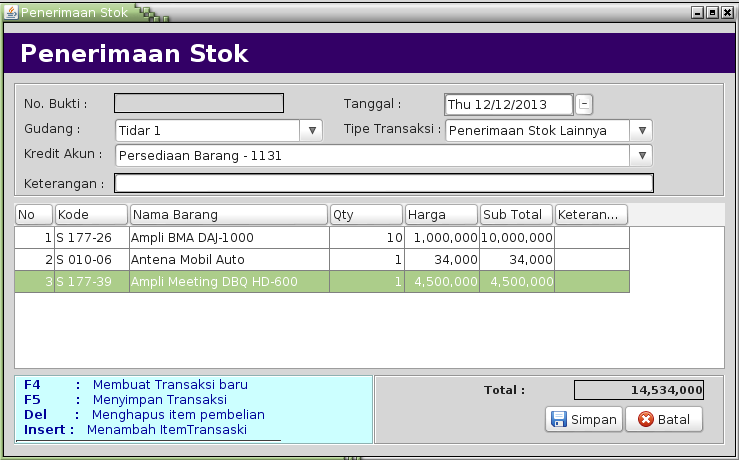
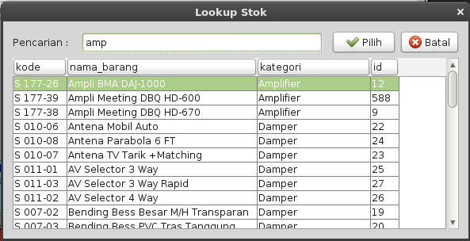
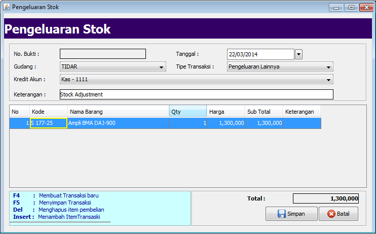
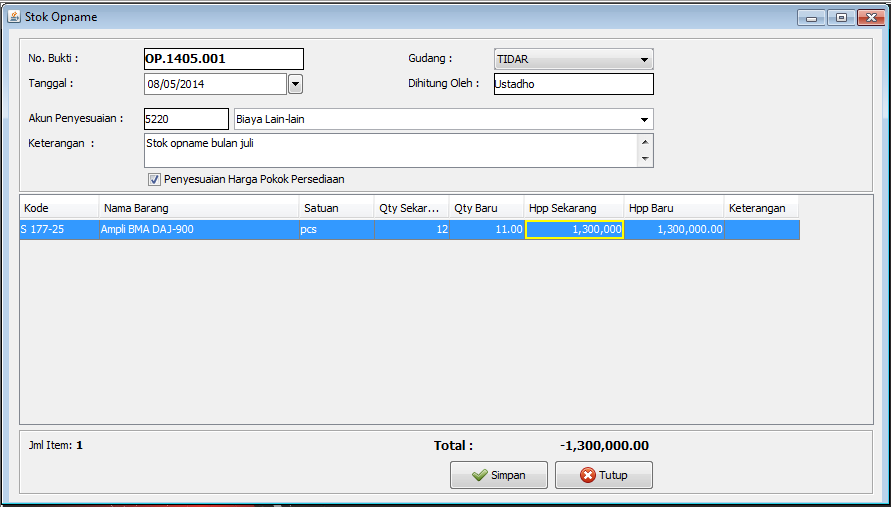

# STOK #

Menu Stok merupakan menu yang berisikan transaksi dan laporan yang berhubungan dengan persediaan barang.
Menu Stok terdiri dari :
- Penerimaan Stok
- Pengeluaran Stok
- Pindah Gudang
- Laporan-laporan stok

Data Master yang harus dipersiapkan.
- Master Stok
- Master COA
- Master Akun Laba Rugi
- Master Gudang
(Lihat Bab mengenai Data Master)

##Penerimaan Stok

Hal pertama yang harus dilakukan terhadap stok adalah memasukkan Saldo Awal stok, terkecuali Anda memulai suatu perusahaan baru yang sama sekali
tidak mempunyai persediaan awal. Entry Saldo Awal persediaan ini dilakukan dengan Menu Penerimaan Stok. 
Penerimaan stok hanya mempengaruhi saldo stok (Quantity dan Harga) dan tidak mempunyai pengaruh terhadap modul lainnya kecuali modul General
Ledger ditentukan oleh Kredit Akun.  
Disamping untuk hal diatas, Penerimaan Stok juga digunakan untuk memasukkan stok selain dari Transaksi Pembelian dari Supplier.

Untuk membuka form Penerimaan Stok ini, klik menu Stok --> Penerimaan Stok.

Pastikan tanggal masuk barang dan gudang. Tipe transaksi digunakan untuk mengklasifikasikan jenis penerimaan barang. 
Isikan keterangan untuk deskripsi transaksi penerimaan barang ini. Pilih kredit Akun untuk posting ke jurnal umum.

Tekan **Insert** untuk menampilkan daftar barang (*lookup item*), kemudian masukkan penggalan kata dari nama barang yang akan kita masukkan.
pastikan ada satu nama stok yang terpilih kemudian tekan Enter atau tekan tombol Pilih.

Jika item tersebut belum pernah masuk ke stok, maka isikan harga persediaan pada kolom Harga, sehingga jika terjadi pengeluaran barang baik dari 
Penjualan maupun pengeluaran stok, harga persediaan akan diambil dari harga yang diinput tersebut.

Ulangi proses menambahkan Insert item-item tersebut sampai semua barang masuk di tabel penerimaan.

Untuk menyimpan transaksi penerimaan stok, tekan tombol **Simpan**.

##Pengeluaran Stok

Pengeluaran Stok merupakan kebalikan dari Penerimaan Stok. Jika pada Penerimaan Stok jumlah stok bertambah, maka pada Pengeluaran Stok,
jumalh stok akan berkurang. Pengeluaran Stok hanya mempengaruhi saldo stok (Quantity dan Harga) dan tidak mempunyai pengaruh terhadap modul
lainnya kecuali modul General Ledger ditentukan oleh Debet Akun.  
Hal ini biasanya dilakukan untuk menyesuaikan stok fisik dengan stok komputer selain dari stok opname.

Untuk membuka form Pengeluaran Stok ini, klik menu Stok --> Pengeluaran Stok.

Pastikan tanggal keluar barang dan gudang. Tipe transaksi digunakan untuk mengklasifikasikan jenis pengeluaran barang. 
Isikan keterangan untuk deskripsi transaksi penerimaan barang ini. Pilih kredit Akun untuk posting ke jurnal umum.

Tekan **Insert** untuk menampilkan daftar barang (*lookup item*), kemudian masukkan sebagian kata dari nama atau kode barang yang akan kita masukkan.
pastikan ada satu nama stok yang terpilih kemudian tekan Enter atau tekan tombol Pilih.

Isikan harga persediaan pada kolom Harga jika pakada kolom tersebut nol, sehingga bisa mengurangi nilai total persediaan.

Ulangi proses menambahkan Insert item-item tersebut sampai semua barang masuk di daftar barang yang dikeluarkan atau dikurangi stoknya.

Untuk menyimpan transaksi pengeluaran stok, tekan tombol **Simpan**.

##Stok Opname

Stok Opname atau mungkin di sistem lain dikenal dengan istilah penyesuaian persediaan adalah aktifitas rutin yang biasa dilakukan oleh suatu perusahaan
untuk menghitung ulang nilai persediaan per tanggal tertentu. Pada prakteknya dibeberapa perusahaan besar bisa dilakukan dua kali dalam setahun.

Sebenarnya fungsi dari form stok opname ini adalah sama dengan form Penerimaan Stok Lain dan Pengeluaran Stok. Perbedaannya adalah, jika aktifitas Penerimaan Stok 
semua item yang ada didaftar adalah akan ditambah jumlah stoknya. Sedangkan pada Pengeluaran Stok semua item yang ada didaftarnya akan dikurangkan stoknya.
Akan tetapi pada form stok opname ini bisa menggabungkan penambahan stok, pengurangan stok maupun memastikan bahwa jumlah stok komputer saat ini adalah sama
dengan stok fisik (Nilai penyesuaiannya Nol).

_**Bagian Header**_

1. Dari menu utama klik menu Stok --> Stok Opname.
2. No. Bukti diisi dengan nomor bukti stok opname, nomor ini harus unik tidak boleh sama dengan No. Bukti Stok Opname yang sebelumnya sudah pernah dientry
3. Pilih gudang untuk menentukan dari mana stok tersebut diihitung
4. Tanggal diisi dengan tanggal penghitungan stok opname
5. _Textbox_ Dihitung Oleh diisi dengan petugas yang melakukan perhitungan dengan nomor bukti yang sudah dientry.
6. Akun Penyesuaian digunakan untuk memposting jurnal yang otomatis dibuat pada saat menyimpan stok opname. Di jurnal umum akun ini akan diisi dengan nilai
Debet jika selisih lebih dan akan diisi di kolom kredit untuk selisih kurang.
7. Keterangan bisa diisi untuk deskripsi proses stok opname dengan nomor bukti tesebut.
8. _Checkbox_ Penyesuaian Harga Pokok Persediaan dicentang jika disamping kita menyesuaikan jumlah barang, kita juga menyesuaikan harga persediaan untuk masing-
masing item.

_**Bagian Detail**_

8. Untuk memasukkan item/ barang yang dihitung tekan tombol **Insert**, maka akan ditampilkan form lookup barang seperti biasanya.
9. Masukkan nama barang atau kode item yang akan dimasukkan. Tekan panah atas/ bawah untuk memindah kursor item yang dipilih
10. Tekan Enter untuk memasukkan item pada baris terpilih kedalam daftar/ tabel detail barang yang di stok opname
11. Secara default kurson akan fokus di kolom Qty Baru. Isikan jumlah fisik dari barang tersebut kemudian tekan enter untuk memastikan update Qty.
12. Jika kita centang _checkbox_ Penyesuaian Harga Pokok Persediaan (bagian header), maka ada kolom Hpp Sekarang dan Hpp Baru ditambahkan di tabel daftar barang.
Secara otomatis Hpp Sekarang diisi sesuai dengan harga persediaan saat ini dari barang tersebut, demikian pula dengan kolom Hpp Baru.
Anda bisa mengubah Hpp Baru, jika harga pokok saat ini tidak cocok.
13. Ulangi langkah 8 sampai 12 untuk memasukkan semua barang yang di-stok opname.

_**Bagian Footer**_

14. Dibagian _footer_ form stok opname terdapat informasi Jumlah baris Item yang sudah dimasukkan. Hal ini sangat berguna pada saat kita sudah menginput banyak baris.
15. Label Total menunjukkan jumlah selisih nilai persediaan hasil perhitungan stok opname. Nilai Minus akan ditampilkan jika total perhitungan mengalami selisih kurang 
(baik Qty maupun Harga Pokok) dan sebaliknya.
16. Tekan tombol **Simpan** jika semua barang sudah masuk di daftar barang.

\newpage

