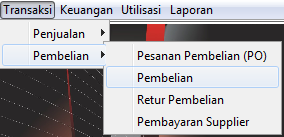
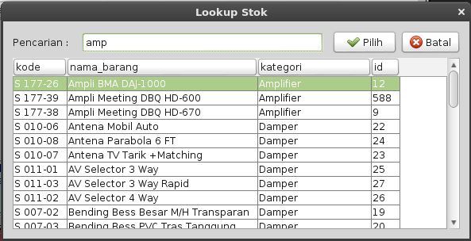

# PEMBELIAN #

Dalam kegiatan bisnis, pembelian merupakan hal penting yang harus dilakukan. Baik untuk perusahaan dagang yang perlu membeli barang
dagangan maupun untuk perusahan industri yang perlu membeli bahan baku untuk keperluan produksi. 

Transaksi pembelian akan menyebabkan nilai persediaan bertambah sekaligus akan menambah hutang supplier. Pada sistem ini mengharuskan 
stok persediaan harus lebih besar dari nol, oleh karena itu jika terjadi pembelian barang ke supplier, harus diinput terlebih dulu 
sebelum dilakukan transaksi penjualan.

##Pesanan Pembelian (Purchase Order)/ PO

PO biasanya dilakukan untuk membuat pesanan daftar barang yang akan dipesan/ dibeli secara tertulis ke supplier. Meskipun di program ini
transaksi pembelian tidak mengharuskan membuat PO terlebih dulu.

Untuk membuat PO, klik menu Transaksi --> Pembelian --> Pesanan Pembelian (PO), maka anda akan mendapati form PO seperti gambar berikut.

Pastikan tanggal pesanan dan input nama supplier yang akan kita pesan. Nama Supplier, Alamat dan Termin pembayaran (TOP) secara otomatis akan terisi 
sesuai dengan master supplier yang sebelumnya sudah kita masukkan.

Tekan Insert untuk memasukkan daftar barang yang akan kita pesan. Harga akan sesuai dengan harga pembelian terakhir item tersebut sesuai dengan 
supplier yang akan dipesan.  

Ulangi tekan Insert untuk memasukkan satu per satu item yang akan dipesan. Tekan tombol **Simpan** untuk menyimpan transaksi PO.

Untuk melihat daftar PO atau PO yang sudah pernah dibuat, bisa dilihat dari menu Daftar --> Pesanan Pembelian - PO, maka anda akan mendapati 
daftar PO serperti gambar berikut.

Kita bisa menambahkan, mengedit dan menghapus PO dari daftar histori pesanan pembelian ini.

##Transaksi Pembelian

Berbeda dengan Penerimaan Barang, entry Pembelian selain berfungsi untuk menambah stok / persediaan barang, juga akan menimbulkan Hutang Dagang
pada Supplier. Oleh sebab itu, dalam entry Pembelian, selain mengisi data stok yang dibeli, user juga harus mengisi data Supplier (Kode Supplier).
Proses lanjutan dari pembelian adalah pembayaran hutang yang dilakukan dalam menu Pembayaran Hutang, dan pengingat hutang jatuh tempo pada saat pertama
kali membuka program.

> **Apa yang harus dipersiapkan**
> - Kode Stok sudah dientry dalam Master Stok
> - Kode Gudang sudah dientry dalam Master Gudang
> - Kode Suppler sudah dientry dalam Master Supplier
> - Data Pembelian Barang

Untuk membuka form pembelian, klik menu Transaksi --> Pembelian --> Faktur Pembelian, maka anda akan mendapati form pembelian seperti gambar berikut

Pastikan Gudang atau tempat yang digunakan untuk menerima stok dari pembelian ini. Secara default nama gudang akan disesuaikan dengan yang disetting dimasing-masing 
komputer, akan tetapi tetap kita bisa mengubah sesuai dengan nama gudang yang lain.

Masukkan nomor bukti transaksi yang berasal dari nomor faktur supplier, kemudian masukkan nama supplier. 
Jika transaksi pembelian sebelumnya didahului dengan pesanan pembelian/ PO, maka masukkan nomor PO tersebut, maka daftar item yang pernah dipesan otomatis 
akan muncul didaftar barang.

Pastikan Termin Pembayaran (TOP) sesuai dengan faktur, karena hal ini akan digunakan untuk menginformasikan kepada kita, mana saja hutang supplier yang berasal 
dari pembelian yang sudah jatuh tempo sesuai dengan termin tersebut.

Jika transaksi bukan berasal dari PO, maka tekan **Insert**, maka form lookup item akan ditampilkan seperti gambar berikut

Masukkan nama atau kode barang yang akan diinput, arahkan tombol panah atas atau bawah untuk memilih daftar item kemudian tekan enter pada item yang akan diinput
atau tekan tombol Pilih.

Sesuaikan dengan jumlah yang diterima sesuai dengan faktur supplier. Harga per unit barang akan sesuai harga PO (jika dari PO) atau sesuai dengan harga pembelian terakhir
jika bukan berasal dari PO.

Ulangi proses insert item sampai semua item masuk ke daftar barang pembelian.

Tekan tombol **Simpan** atau **F5** untuk menyimpan transaksi pembelian tersebut. Jika proses simpan sukses, maka akan muncul dialog konfirmasi bahwa simpan 
transaksi pembelian sukses dan muncul tampilan print invoice seperti gambar berikut.

Histori transaksi pembelian yang sudah pernah dibuat bisa dilihat dari menu Daftar --> Pembelian, maka kita akan mendapati form histori pembelian seperti gambar berikut.

Tentukan tanggal awal dan akhir dari pembelian yang akan dilihat, masukan kata pencarian (bisa penggalan nama supplier atau nama item) kemudian tekan **Enter**, maka 
akan muncul daftar pembelian yang sudah pernah diinput di tabel bagian atas.

Tabel bawah menununjukkan daftar item yang dibeli untuk nomor faktur yang terpilih atau diklik pada tabel pembelian (bagian atas).

Dari daftar pembelian ini kita bisa print ulang bukti pembelian, menghapus data pembelian, atau mengedit data pembelian tersebut dengan klik pada tombol 
dibawah detail item pembelian.

##Retur Pembelian

Retur Pembelian adalah kebalikan dari Pembelian, yang mana jika Pembelian berfungsi untuk menambah Persediaan / Stok, maka Retur
Pembelian akan mengurangi Persediaan / Stok. 

Dalam sitem ini Retur Pembelian mempunyai dua jenis yaitu :
- Retur Pembelian dengan No. Bukti Pembelian.
- Retur Pembeian tanpa No. Bukti Pembelian

###Retur Pembelian dengan No. Bukti Pembelian

Dengan adanya No. Bukti Pembelian, maka secara otomatis beberapa data yang sudah tercantum dalam Pembelian dapat digunakan langsung pada
entry Retur Pembelian. Data tersebut antara lain Kode Supplier, Nama Supplier, Kode-Kode Stok, Satuan, Quantity Beli dan Harga Beli.
Retur Pembelian akan dibatasi pada data dari No. Bukti Pembelian, misalkan, Kode Stok tidak boleh kode stok yang tidak tercantum pada
pembelian, Quantity Stok juga tidak boleh lebih besar dari Qty Beli dan Harga juga akan dihitung secara otomatis berdasarkan harga beli.

###Retur Pembelian tanpa No. Bukti Pembelian

Sebaliknya jika No. Beli tidak diisi, maka field-field lainnya bebas dientry oleh user, dan tentunya Retur Pembelian ini dianggap tidak mempunyai
hubungan dengan Pembelian secara langsung.

**Apa yang harus dipersiapkan**  
1. Kode Stok sudah dientry dalam Master Stok
2. Kode Gudang sudah dientry dalam Master Gudang
3. Kode Supplier sudah dientry dalam Master Supplier
4. Data Retur Pembelian Barang (termasuk Nomor Bukti Pembelian jika ada)

Untuk memulai membuat retur pembelian, klik menu Transaksi --> Pembelian --> Retur Pembelian, atau dari __Taskpane menu__ (Daftar menu di layar samping kiri)
group Transaksi --> Retur Pembelian, maka kita akan mendapati form transaksi pembelian seperti pada gambar berikut.

Masukkan nama supplier yang akan kita retur, kemudian tekan enter atau panah bawah untuk berpindah ke field berikutnya.
Untuk retur dengan nomor bukti pembelian, maka masukkan nomor bukti transaksi pembelian yang akan diretur. Pastikan nama gudang sudah benar, supaya
barang akan terkurangi dari gudang tersebut.

Jika retur tidak berasal dari transaksi pembelian yang ada di sistem ini, maka kosongkan saja pada field No. Faktur Beli, atau jika sudah terisi sebelumnya,
maka tekan Esc untuk menghilangkan isi dari field tersebut.

Keterangan retur diisi sesuai dengan keinginan atau deskripsi mengapa barang-barang tersebut diretur.

Proses selanjutnya adalah
Tekan tombol **Insert** untuk memasukkan nama barang yang akan diretur, maka jika retur bersumber dari pembelian, maka hanya item barang yang sesuai
dengan nomor bukti tersebut saya yang akan ditampilkan dan bisa diretur, dengan syarat Qty Sisa pembelian (setelah dikurangi retur lain), masih cukup.

Jika retur tidak berasasal dari transaksi pembelian, maka jika kita **Insert**, maka semua item akan ditampilkan, dan harga transaksi akan disesuaikan 
dengan harga terakhir dari transaksi pembelian supplier tersebut.

Ulangi proses insert untuk menambahkan semua item yang akan kita retur ke Supplier tersebut masuk ditabel barang dibagian bawah.

Setelah semua barang yang akan diretur sudah masuk, maka proses selanjutnya adalah menyimpan transaksi tersebut supaya mengurangi stok dan juga
mengurangi tagihan ke supplier yang bersangkutan.

Histori retur pembelian bisa dilihat jadi satu dengan history pembelian, akan tetapi yang membedakan adalah kategori transaksi pada list tersebut, adalah
Pembelian atau Retur Pembelian. Kita bisa melihat histori ini dari menu Daftar --> Pembelian, atau dari menu **Taskpane** sebelah kiri layar utama, kemudian pilih 
Daftar --> Pembelian, maka kita akan mendapati histori pembelian dan retur pembelian seperti gambar berikut.
 

Dari menu histori ini kita bisa mencetak bukti retur atau pembelian tersebut.
 
##Pembayaran Hutang

Transaksi pembelian yang kita masukkan akan menimbulkan hutang supplier yang harus kita bayar terutama pada saat tanggal jatuh tempo hutang pembelian tersebut.
Ada dua cara untuk kita bisa membayarkan hutang supplier yaitu dari menu Transaksi --> Pembelian --> Pembayaran Hutang, dan dari Reminder Piutang Jatuh Tempo 
dan Hutang Jatuh Tempo.

###Transaksi Pembayaran Hutang

Untuk membuka form pembayaran hutang supplier, klik menu Transaksi --> Pembelian --> Pembayaran Hutang, maka kita akan mendapati form pembayaran hutang seperti gambar berikut

Masukkan nama supplier yang akan dibayar, kemudian tekan Enter, maka semua daftar hutang akan ditampilkan pada tabel dibawahnya.
Pilih Kas/ Bank sebagai akun yang akan digunakan untuk jurnal ke modul accounting. Kemudian pilih alat pembayaran yang digunakan untuk pembayaran, hal ini digunakan untuk
grouping laporan pembayaran dengan jenis alat bayar yang dipakai.

Untuk pembayaran dengan cek/ giro maka masukkan nomor Cek/ Giro dan tanggal jatuh tempo cek atau giro tersebut.
Total pembayaran adalan akumulasi dari total pembayaran atau transfer yang dibayarkan.

Pada bagian tabel daftar nota supplier, klik pada _checkbox_ pada kolom Pilih untuk pembayaran nota pada baris tersebut. Jika total pembayaran kurang dari sisa nota, 
maka ubah Jumlah pada kolom Bayar.

Total hutang, dan total pembayaran supplier saat ini ditampilkan pada Total Bayar dibagian bawah daftar nota. Untuk mengkonfirmasi jumlah pembayaran maka masukkan 
jumlah Total Pembayaran dibagian atas sebelah kanan Alat Pembayaran, atau klik tombol Total Pembayaran untuk mempermudah menyamakan dengan total pembayaran dibagian bawah.

Tekan **Simpan** untuk menyimpan transaksi pembayaran supplier ini.

Semua transaksi pembayaran hutang yang sudah dilakukan, bisa dilihat kembali dari menu Daftar --> Pembayaran Supplier, maka kita bisa mendapati form daftar pembayaran 
hutang seperti gambar berikut.

###Reminder Hutang Jatuh Tempo

Selain dari pembayaran diatas sistem ini juga menyediakan cara lain untuk melakukan pembayaran supplier.

Pada sistem ini ada fitur yang menginformasikan daftar hutang dan piutang jatuh tempo pada saat pertama kali kita membuka program ini, berupa Reminder atau 
Pengingat. Dari layar Reminder tersebut kita bisa langsung cek, mana saja hutang yang harus kita bayar per hari ini.
Kita bisa melihat daftar hutang yang sudah jatuh tempo per hari ini seperti gambar berikut.

Pada layar pengingat tersebut terbagi menjadi dua bagian besar yaitu Piutang Jatuh Tempo dan Hutang Jatuh Tempo. Pada bagian HUtang Jatuh Tempo, 
klik Tanda Plus (+) atau *double-click* untuk menampilkan daftar nama supplier yang harus dibayar, 
kemudian kita bisa klik tanda Plus (+) atau *double-click* lagi pada nama supplier untuk menampilkan daftar nota yang harus dilunasi pembayarannya.

Pada baris nota klik kanan, maka akan ditampilkan **pop-up menu** yaitu:

+ **Detail Transaksi** : Untuk menampilkan detail nota transaksi pembelian tersebut
+ **Bayar**: Menampilkan form transaksi pembayan untuk supplier tersebut
+ **Refresh**: Untuk menampilkan ulang daftar piutang dan hutang jatuh tempo.

Jika kita klik Detail Transaksi, atau *double-click* maka detail transaksi pembelian tersebut akan ditampilkan seperti gambar berikut.

Hal ini digunakan untuk meyakinkan bahwa nota yang akan kita bayar adalah benar atau untuk sekedar melihat detail item dari nota tersebut.

Untuk melakukan pembayaran dari reminder, maka kita klik Bayar maka form pembayaran seperti diatas akan ditampilkan. Bedanya pada nota yg kita klik kanan 
secara otomatis akan tercentang dan hanya hutang jatuh tempo saja yang ditampilkan disini.

Jika ada nota lain yang akan dibayar, maka klik checkbox Pilih pada baris nota. Kemudian pastikan Kas/ Bank untuk jurnal dan alat bayar yang digunakan.
Jika pembayaran menggunakan cek/ giro masukkan nomor cek/ giro dan tanggal jatuh tempo.

Tekan **Simpan** untuk menyimpan transaksi pembayaran supplier ini.

Semua transaksi pembayaran hutang yang sudah dilakukan, bisa dilihat kembali dari menu Daftar --> Pembayaran Supplier, maka kita bisa mendapati form daftar pembayaran.

##Histori Harga Pembelian per Stok

Salah satu nilai tambah dari sistem ini adalah kita bisa mengecek histori harga pembelian per satu stok dengan filter semua supplier atau supplier tertentu saja.
Untuk membuka fasilitas ini, kita bisa melakukannya dengan:

1. Dari menu utama, klik menu Stok --> Histori Harga Pembelian per Stok
2. Kosongkan nama supplier untuk menampilkan semua supplier, atau masukkan nama supplier jika hanya melihat histori pembelian untuk supplier tersebut saja. 
3. Masukkan Nama Stok yang akan dilihat (Nama stok ini wajib diisi)
4. Klik tombol **Tampilkan** untuk melihat histori pembelian yang pernah dilakukan untuk stok tersebut.

##Laporan Pembelian

Sistem menyediakan beberapa jenis laporan untuk Pembelian sesuai dengan kebutuhan pemakai pada umumnya, atau sesuai dengan kebutuhan
internal Rejeki Makmur Surabaya. 

Laporan-laporan ini terdiri dari :

* Transaksi Pembelian
* Retur Pembelian
* Pembelian Per Supplier
* Rekap Transaksi Pembelian per Nota
* Pembelian per Barang
* Laporan Hutang Supplier

Untuk membuka laporan-laporan tersebut kita bisa klik menu Laporan --> Pembelian, maka daftar laporan yang bisa dilihat bisa dilihat seperti gambar berikut.

**Laporan Transaksi Pembelian**

Laporan ini biasanya digunakan untuk menampilkan daftar pembelian periode tertentu dengan format paling detail dikelompokkan berdasarkan tanggal pembelian, 
seperti format nota pembelian.
Model tampilan dari laporan ini adalah seperti berikut.

**Laporan Retur Pembelian**

Daftar retur pembelian yang pernah kita lakukan bisa kita cetak atau tampilkan dari menu Laporan Retur pembelian. Pilih tanggal awal dan akhir dari
retur, kemudian tekan tombol **Tampilkan**, maka laporan akan ditampilkan seperti gambar berikut.

**Pembelian Per Supplier**

Adalah digunakan untuk menampilkan laporan detail pembelian yang dikelompokkan berdasarkan nama supplier dan diurutkan berdasarkan tanggal transaksi.
Tampilan dari laporan tersebut bisa dilihat seperti gambar berikut.

**Rekap Transaksi Pembelian per Nota**

Laporan Rekap ini hanya menampilkan total transaksi berdasarkan nomor faktur supplier, tanggal, nama supplier dan total transaksi.
Contoh laporan yang dihasilkan adalah seperti gambar berikut ini.

**Pembelian per Barang**

Untuk menampilkan histori pembelian per barang, kita bisa ambil dari form laporan pembelian ini juga. Filter yang disediakan untuk laporan ini disamping 
tanggal awal dan akhir transaksi, kita juga bisa menentukan satu item saja atau kita bisa mengosonginya untuk menampilkan semua nama barang.

Hasil dari tampilan laporan tersebut adalah seperti gambar dibawah ini.

**Laporan Hutang Supplier**

Rekap Hutang per supplier bisa dilihat dari laporan nomor 6 dari form laporan pembelian ini. maka akan ditampilkan hasil laporan hutang supplier 
yang belum lunas seperti gambar berikut.

\newpage

