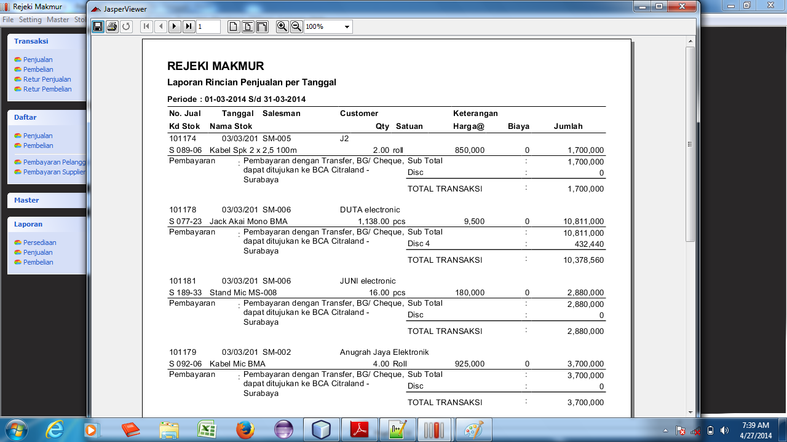

# PENJUALAN #

Penjualan merupakan kegiatan bisnis yang paling penting. Karena dengan penjualan, suatu perusahaan dapat menhasilkan keuntungan. Baik untuk
perusahaan dagang yang perlu menjual barang dagangan maupun untuk perusahan industri yang perlu menjual hasil produksi dan perusahaan jasa
yang menjual pelayanan.

Menu Penjualan Terdiri dari: 

* Pesanan Penjualan (SO)
* Faktur Penjualan
* Retur Penjualan
* Penerimaan Pelanggan
* Daftar Penjualan
* Laporan Penjualan

Daftar menu diatas dapat dilihat dari menu Transaksi --> Penjualan, maka kita bisa melihat daftar menu penjualan seperti gambar berikut.

Selain dari menu diatas, kita juga bisa akses secara cepat dari _Taskpane Menu_ sebelah kiri layar utama, seperti gambar berikut.

##Pesanan Penjualan

Pesanan Penjualan adalah kegiatan yang biasa dilakukan oleh pelanggan yanng akan membeli barang kita. Entri data pesanan penjualan diperlukan jika kita ingin 
mengelola data pesanan secara elektronik untuk selanjutnya dianalisa mana pesanan yang bisa dipenuhi dan mana pesanan yang tidak bisa terpenuhi.

Biasanya perusahaan besar menggunakan pesanan penjualan ini untuk menganalisa sasaran mutu penjualan, seberapa target yang bisa dipenuhi oleh bagian penjualan
dan seberapa cepat kita bisa penuhi permintaan pesanan pelanggan tersebut.

Untuk membuka form pesanan penjualan, klik menu Transaksi --> Penjualan --> Pesanan Penjualan (SO), maka kita bisa menginput data pesanan penjualan seperti 
gambar berikut.

**Apa yang harus dipersiapkan:**

* Kode Barang yang akan dipesan sudah masuk di Master Item
* Kode Pelanggan sudah diinput di Master Pelanggan
* Kode Salesman sudah terinput di Master Salesman
* Data Pesanan Pelanggan

**Entri Data Pesanan Penjualan**

_**Bagian Header**_

1. Masukkan tanggal pesanan pelanggan, atau jika pesanan adalah hari ini, maka secara default tanggal sudah diisi dengan tanggal system hari ini.
2. Pilih pelanggan yang melakukan pesanan dengan memasukkan kata kunci pencarian di field pelanggan, maka daftar pelanggan akan ditampilkan. Arahkan tombol panah
atas atau ke bawah untuk memilih pelanggan kemudian tekan Enter. 
3. Isikan termin pembayaran pelanggan sesuai dengan jumlah hari pembayaran atau jatuh tempo.
4. Pilih Salesman jika pesanan berasal dari Salesman dan bukan Customer CASH.

_**Bagian Detail**_

5. Tekan _**Insert**_ untuk memasukkan daftar barang yang akan dipesan, maka akan muncul form lookup barang seperti gambar berikut.
Masukkan kata kunci pencarian item tersebut, gunakan panah atas-bawah untuk memilih nama barang yang akan dipesan kemudian tekan Enter untuk 
memilih item yang akan dipesan.
6. Masukkan Qty pesanan dikolom Qty. Secara default Qty penjualan diisi dengan angka 1, tapi jika akan diubah maka isikan sesuai Qty yang dipesan.
7. Ulangi proses 1 diatas sampai semua item masuk di daftar pesanan

Setelah semua barang masuk ditabel daftar item pesanan, kemudian tekan tombol **Simpan** untuk menyimpan data pesanan tersebut.

Histori pesanan yang sudah pernah dibuat bisa dilihat kembali dari menu Daftar --> Pesanan Penjualan (SO), maka kita bisa melihat daftar pesanan yang sudah pernah 
kita buat seperti gambar berikut.

Masukkan tanggal awal dan akhir pembuatan pesanan, kemudian tekan **Tampilkan** untuk melihat history yang sudah pernah dibuat pada periode tanggal tersebut.

**Edit Data Pesanan Penjualan**

Untuk mengubah data pesanan yang sudah pernah dimasukkan bisa dilakukan dari histori pesanan penjualan tersebut, klik pada bari pesanan yang kan diedit kemudian klik **Edit**, maka akan ditampilkan
detail pesanan penjualan tersebut.

Setelah tampil detail pesanan tersebut, kemudian lakukan perubahan data pesanan tersebut kemudian tekan **Simpan** untuk memastikan perubahan pesanan penjualan
tersebut.

##Faktur Penjualan

Bisa dikatakan inti dari sistem yang dibuat ini adalah digunakan untuk mengelola sistem penjualan ke pelanggan. Oleh karena pada sistem ini disesuaikan dengan 
kebutuhan sistem penjualan yang ada di PT. Rejeki Makmur Surabaya secara khusus.

**Apa yang harus dipersiapkan:**

* Kode Barang yang akan dipesan sudah masuk di Master Item
* Kode Pelanggan sudah diinput di Master Pelanggan
* Kode Salesman sudah terinput di Master Salesman
* Kode Gudang sudah dimasukkan di Master Gudang
* Data Penjualan
* Stok Barang harus lebih besar atau sama dengan Qty Jual. Hal ini bisa dilakukan dengan memasukkan transaksi pembelian terlebih dulu, atau jika item sudah ada 
sebelum dimulainya program ini, maka harus di entri Penerimaan Barang Lainnya.

**Entri Faktur Penjualan**

_**Bagian Header**_

1. Dari menu Utama klik menu Transaksi --> Penjualan --> Faktur Penjualan untuk menampilkan layar Faktur Penjualan.
2. Masukkan Nomor Faktur sebagai nomor bukti transksi penjualan dengan _unique_ (belum pernah dipakai sebelumnya). Jika nomor yang dimasukkan sudah 
pernah dipakai, maka pada saat menyimpan transaksi ini akan muncul pesan bahwa nomor tersebut sudah pernah digunakan sebelumnya.
3. Tanggal merupakan tanggal transaksi untuk nomor bukti diatas. Pilihlah tanggal sesuai dengan tanggal nomor bukti atau gunakan
dropdown calender yang tersedia. Tekan {Enter untuk melanjutkan}
4. Gudang merupakan combobox yang dapat dipilih dari dropdown. Kode Gudang sudah harus terdaftar dalam Master Gudang sebelum dapat digunakan. Jika Kode
Gudang belum di daftar, [Keluar] dari entry ini, masuk ke Master Gudang, entry data gudang tersebut, kemudian kembali aktifkan layar entry ini.
5. Kode Customer dapat dientry secara langsung daftar customer (relasi) yang tersedia. Kode Customer harus sudah terdaftar di Master Customer. Jika belum terdaftar, [Keluar] dari entry ini, isi data customer di
Master Customer, kemudian kembali lagi ke layar entry ini.
6. Jika faktur berasal dari pesanan penjualan (SO), maka masukkan nomor order di _field_ No. Order. Daftar barang secara otomatis akan ditampilkan
sesuai yang sudah dimasukkan di Pesanan Penjualan dengan nomor tersebut.
7. TOP (_Termin of Payment_)/Jatuh Tempo secara otomatis akan terisi sesuai TOP yang sudah disetting di master Pelanggan, tapi jika TOP tidak sama, maka kita 
bisa mengubah secara manual di field TOP/ Jatuh Tempo dengan jumlah hari tempo pelunasan faktur ini.
8. Salesman adalah combobox yang isinya dapat dipilih dari dropdown yang tersedia.
9. Untuk pengiriman barang yang menggunakan Expedisi, maka isikan nama expedisi yang kita gunakan.
10. Keterangan merupakan textbox multi baris. Pada textbox ini Anda bebas meng-entry keterangan untuk transaksi yang sedang
dimasukkan. Klik pada mouse untuk pindah ke entry berikutnya anda tidak dapat menggunakan {Enter}, karena pada textbox multi baris, {Enter} berfungsi untuk
pindah ke baris berikutnya dalam textbox.

_**Bagian Detail**_

11. Tekan **Insert** untuk menambah baris item, maka akan ditampilkan form Lookup Item. Masukkan nama barang atau kata kunci pencarian, kemudian tekan panah atas-bawah 
untuk memilih item yang akan ditambahkan. Tekan {Enter} untuk menambahkan item tersebut ke tabel faktur. 
12. Setelah item ditambahkan dari _lookup item_ , kursor secara otomatis akan focus di kolom Qty. Secara default Qty akan diisi dengan angka 1, untuk Qty lebih dari itu 
maka ubahlah Qty tersebut.
13. Harga dan Discount secara otomatis akan ditampilkan sesuai harga dan diskon terakhir transaksi dengan pelanggan tersebut. Jika harga dan diskon tidak sesuai
maka ubahlah harga dan diskon yang benar untuk saat ini. 
14. Untuk kolom diskon pada penjualan dan pembelian di sistem ini dimungkinkan untuk diskon bertingkat. Misal untuk diskon 10%+5%+10%, kita bisa memasukkan di kolom diskon
dengan 10+5+10. Jika tidak ada diskon atau Nol, maka anda bisa mengosongi kolom diskon atau memasukkan angka **0** di kolom diskon tersebut.
15. Sub Total dihitung berdasarkan Formula  
    **Sub Total = (Qty * Harga) - Nominal Diskon + Biaya Lain**  
15. Salah satu fitur yang diminta dari sistem ini adalah, bisa menampilkan HPP (Harga Pokok Persediaan) terakhir pada saat memasukkan item penjualan. Oleh karena itu
kita bisa melihat kolom HPP Terakhir ini di kolom sebelah Sub Total. 
16. Ulangi proses 9 untuk memasukkan item lain sampai semua item masuk di tabel detail penjualan.

_**Bagian Footer**_

1. Sub Total merupakan textbox yang menampilkan jumlah kolom Total Nominal. Data ini hanya untuk informasi dan tidak dapat diedit.
2. Disc merupakan textbox yang dapat dientry dengan angka diskon bertingkat misal (10+5+10). Angka ini merupakan persentasi discount yang dihitung
dari Sub Total. Hasil perhitungan akan ditampilkan pada textbox sebelahnya.
3. Textbox Discount akan dimunculkan sendiri oleh sistem sesuai dengan persentasi discount yang Anda entry sebelumnya.
4. Grand Total merupakan akumulasi dari textbox SubTotal dikurangi Nominal Diskon
5. Bayar diisi sesuai dengan nilai Grand Total untuk penjualan Tunai.

Setelah semua langkah dilakukan, maka tekan tombol **Simpan** untuk menyimpan transaksi penjualan tersebut. Jika proses simpan sukses maka akan muncul dialog 
informasi bahwa proses simpan faktur sukses. dan akan ditampilkan cetak faktur seperti gambar berikut.

##Retur Penjualan

Retur Penjualan adalah kebalikan dari Penjualan, yang mana jika Penjualan akan mengurangi jumlah Persediaan / Stok, maka Retur Penjualan akan
menambah kembali Persediaan / Stok.
Dalam sistem ini Retur Penjualan mempunyai dua jenis yaitu :

1. Retur Penjualan dengan No. Bukti Penjualan (No. Jual)
2. Retur Penjualan tanpa No. Bukti Penjualan

###Retur Penjualan dengan No. Bukti Penjualan

Dengan adanya No. Bukti Penjualan, maka secara otomatis beberapa data yang sudah tercantum dalam Penjualan dapat digunakan langsung pada entry
Retur Penjualan. Data tersebut antara lain Kode Customer, Nama Customer, Kode-Kode Stok, Satuan, Quantity Jual dan Harga Jual.

Retur Penjualan akan dibatasi pada data dari No. Bukti Penjualan, misalkan, Kode Stok tidak boleh kode stok yang tidak tercantum pada penjualan,
Quantity Stok juga tidak boleh lebih besar dari Qty Jual dan Harga juga akan dihitung secara otomatis berdasarkan harga jual.

###Retur Penjualan tanpa No. Bukti Penjualan

Sebaliknya jika No. Faktur Jual tidak diisi, maka field-field lainnya bebas dientry oleh user, dan tentunya Retur Penjualan ini dianggap tidak mempunyai
hubungan dengan Penjualan secara langsung.

**Apa yang harus dipersiapkan**

1. Kode Stok sudah dientry dalam Master Stok
2. Kode Gudang sudah dientry dalam Master Gudang
3. Kode Customer sudah dientry dalam Master Customer
4. Data Retur Penjualan Barang (termasuk Nomor Bukti Penjualannya jika ada)

**Entri data Retur Penjualan**

_**Bagian Header**_

1. Dari Menu Utama, klik Transaksi --> Penjualan --> Retur Penjualan
2. Masukkan nama pelanggan yang mengembalikan barangnya, kemudian tekan Enter.
3. No. Bukti adalah nomor bukti Retur Penjualan ini. Jika retur ini berasal dari penjualan sebelumnya, maka kita bisa isikan nomor bukti
dengan nomor faktur jual ditambah '-R' dibelakang nomor bukti, untuk menandakan transaksi ini adalah retur dari nomor bukti penjualan tersebut.
4. Tanggal Retur secara otomatis diisi dengan tanggal system saat ini, tapi kita bisa ubah jika tanggal retur adalah sebelum hari ini atau sesudahnya.
5. No. Faktur Jual merupakan Nomor Bukti Transaksi Penjualan yang pernah digunakan untuk pelanggan tersebut. Jika kita melakukan retur dengan nomor bukti transaksi
penjualan, maka masukkan sesuai nomor bukti penjualan tersebut. Jika penjualan yang diretur bukan berasal dari penjualan dengan sistem baru ini, maka tekan {Esc} supaya
nomor No. Faktur Jual dikosongkan. Atau jika diawal memang tanpa No. Faktur Jual, maka kita bisa lewati saja Nomor ini.
6. Tanggal Faktur akan secara otomats ditampilkan disebelah No. Faktur Jual, jika retur ini berasal dari No. Faktur sebelumnya.
7. Gudang merupakan combobox yang dapat dientry secara langsung atau dipilih dari dropdown.
8. Keterangan merupakan textbox multi baris. Pada textbox ini Anda bebas meng-entry keterangan untuk transaksi yang sedang
dimasukkan. Klik pada mouse untuk pindah ke entry berikutnya anda tidak dapat menggunakan {Enter}, karena pada textbox multi baris, {Enter} berfungsi untuk
pindah ke baris berikutnya dalam textbox.

_**Bagian Detail**_

9. Tekan **Insert** untuk menambah baris item, maka akan ditampilkan form Lookup Item. Untuk retur dengan nomor faktur penjualan, maka item yang ditampilkan hanya 
yang pernah dijual dengan nomor bukti tersebut. Jika nomor bukti dikosongkan maka semua daftar item akan ditampilkan Masukkan nama barang atau kata kunci pencarian, kemudian tekan panah atas-bawah 
untuk memilih item yang akan ditambahkan. Tekan {Enter} untuk menambahkan item tersebut ke tabel faktur. 

10. Setelah item ditambahkan dari _lookup item_ , kursor secara otomatis akan focus di kolom Qty. Secara default Qty akan diisi dengan angka 1, jika retur dengan No. Bukti
Penjualan maka Qty hanya bisa diisi dengan nilai <= Sisa Qty Penjualan.
11. Untuk retur dengan nomor Bukti, Harga dan Diskon item secara otomatis disesuaikan dengan harga dan diskon dengan nomor bukti penjualan tersebut.
12. Harga dan Discount untuk retur tanpa No. Faktur Jual secara otomatis akan ditampilkan sesuai harga dan diskon terakhir transaksi dengan pelanggan tersebut. 
Jika harga dan diskon tidak sesuai maka ubahlah harga dan diskon yang benar 
13. Untuk kolom diskon pada penjualan dan pembelian di sistem ini dimungkinkan untuk diskon bertingkat. Misal untuk diskon 10%+5%+10%, kita bisa memasukkan di kolom diskon
dengan 10+5+10. Jika tidak ada diskon atau Nol, maka anda bisa mengosongi kolom diskon atau memasukkan angka **0** di kolom diskon tersebut.
13. Sub Total dihitung berdasarkan Formula  
    **Sub Total = (Qty * Harga) - Nominal Diskon + Biaya Lain**  
14. Ulangi proses 9 untuk memasukkan item lain sampai semua item masuk di tabel detail penjualan.

_**Bagian Footer**_

1. Sub Total merupakan textbox yang menampilkan jumlah kolom Total Nominal. Data ini hanya untuk informasi dan tidak dapat diedit.
2. Disc merupakan textbox yang dapat dientry dengan angka diskon bertingkat misal (10+5+10). Angka ini merupakan persentasi discount yang dihitung
dari Sub Total. Hasil perhitungan akan ditampilkan pada textbox sebelahnya.
3. Textbox Discount akan dimunculkan sendiri oleh sistem sesuai dengan persentasi discount yang Anda entry sebelumnya.
4. Grand Total merupakan akumulasi dari textbox SubTotal dikurangi Nominal Diskon
5. Bayar diisi sesuai dengan nilai Grand Total untuk penjualan Tunai.

Setelah semua langkah dilakukan, maka tekan tombol **Simpan** untuk menyimpan transaksi penjualan tersebut. Jika proses simpan sukses maka akan muncul dialog 
informasi bahwa proses simpan faktur sukses. dan akan ditampilkan cetak faktur seperti gambar berikut.

History retur penjualan yang sudah pernah dibuat, bisa dilihat dari menu Daftar --> Penjualan, maka kita bisa melihat histori retur penjualan 
digabung dengan histori penjualan.

**Edit data Retur Penjualan**  
1. Dari menu utama, klik menu Daftar --> Penjualan, kemudian cari retur penjualan dengan memilih tanggal awal dan akhir daftar penjualan & retur.
2. Klik pada baris data retur penjualan yang akan diedit.
3. Form Retur Penjualan akan ditampilkan dengan detail nama pelanggan dan detail item yang diretur.
4. Ubahlah bagian dari retur yang salah
5. Klik tombol **Simpan** untuk menyimpan perubahan data retur penjualan tersebut.

**Hapus data Retur Penjualan**  
1. Dari menu utama, klik menu Daftar --> Penjualan, kemudian cari retur penjualan dengan memilih tanggal awal dan akhir daftar penjualan & retur.
2. Klik pada baris data retur penjualan yang akan dihapus.
3. Konfirmasi apakah data retur akan ditampilkan. 

5. Klik tombol **Yes** untuk memastikan penghapusan data tersebut.

**Cetak Ulang Retur Penjualan**  

1. Dari menu utama, klik menu Daftar --> Penjualan, kemudian cari retur penjualan dengan memilih tanggal awal dan akhir daftar penjualan & retur.
2. Klik pada baris data retur penjualan yang akan dicetak.
3. Klik tombol **Print** untuk menampilkan retur penjualan, kemudian tekan icon print di tampilkan retur tersebut. 

##Histori Harga Penjualan

Untuk mempermudah kita melihat ulang harga penjualan per satu stok, maka sistem ini menyediakan fitur berupa Histori Harga Penjualan Per Stok.
Dengan form ini kita bisa melihat dan membandingkan harga penjualan per satu item/ stok antar pelanggan berbeda maupung bisa kita filter dengan pelanggan yang sama
tapi kita tetap bisa melihat riwayat harga penjualan dari waktu ke waktu.

Untuk membuka form ini, dari menu utama klik menu Stok --> Histori Harga Penjualan Per Stok. Masukkan nama barang yang akan kita lihat, jika kita ingin melihat 
histori penjualan stok untuk semua pelanggan, maka kita bisa mengosongkan nama pelanggan di textbox Pelanggan. Tapi jika kita hanya ingin melihat history item/ stok 
tersebut terbatas hanya untuk satu pelanggan saja, maka isikan nama pelanggan di textbox Pelanggan tersebut.

##Penerimaan Pelanggan

Pembayaran pelanggan disistem ini kita sebut dengan istilah 'Penerimaan Pelanggan'. Dengan form Penerimaan Pelanggan ini kita bisa memasukkan pembayaran pelanggan
dan pengurangan retur pelanggan.

**Apa yang harus dipersiapkan**

1. Kode Alat Bayar sudah dimasukkan di Master Alat Bayar
2. Kode Akun Kas dan Bank sudah dimasukkan di Master Chart of Account (COA)
2. Kode Customer sudah dientry dalam Master Customer
3. Data Penjualan dan atau Retur sudah dimasukkan

###Pembayaran/ Penerimaan Pelanggan

Untuk menampilkan piutang per pelanggan dan melakukan pembayaran terhadap piutang tersebut, kita bisa membukanya dari menu utama pilih Transaksi --> Penjualan 
--> Penerimaan Pelanggan

**Entri data Penerimaan Pelanggan**

_**Bagian Header**_

1. Dari Menu Utama, klik Transaksi --> Penjualan --> Penerimaan Pelanggan
2. Terima Dari diisi dengan nama pelanggan yang melakukan pembayaran piutang.
3. Kas/ Bank diisi dengan No. Akun yang digunakan untuk men-debet jurnal pembayaran piutang pelanggan. 
4. Alat Bayar diisi dengan jenis alat pembayaran yang digunakan oleh pelanggan untuk membayar. Data ini nantinya digunakan untuk laporan tanda terima piutang pelanggan.
5. No. Cek/ Giro dan Jatuh Tempo diisi jika pembayaran dengan Giro dan alat pembayaran lain yang tidak langsung cair
6. Daftar piutang pelanggan yang belum lunas akan dimunculkan ditabel daftar piutang
7. Total Pembayaran harus diisi sesuai dengan jumlah total yang dibayar oleh pelanggan, proses simpan transaksi akan ditolak jika Total ini < dari Total yang dibayar
dibagian footer.

_**Bagian Detail**_

8. Rincian daftar piutang pelanggan per Nota Penjualan dan Retur akan ditampilkan di tabel detail dengan format sebagai berikut:  
    * No. Faktur Penjualan: No. Bukti Faktur Penjualan atau Retur Penjualan
    * Tanggal Penjualan: Tanggal transaksi penjualan/ retur penjualan
    * Nilai Penjualan: Grand Total dari transaksi
    * Terbayar: Jumlah yang sudah dibayar untuk No. Bukti tersebut
    * Sisa: Kalkukasi dari Grand Total Nota dikurangi dengan Jumlah yang sudah dibayar
    * Bayar : Jumlah yang dibayar saat ini
    * Diskon: Jika ada potongan piutang lagi dari jumlah nota yang sudah diterbitkan, ini akan mengurangi piutang pelanggan tersebut.
    * Pilih: Adalah _checkbox_ yang jika kita centang, maka kolom Bayar otomatis diisi dengan nilai Sisa Piutang pada Nota tersebut.
9. Masukkan jumlah pembayaran di kolom Bayar sesuai dengan nominal yang dibayarkan. Jika nominal yang dibayar sesuai dengan sisa tagihan, maka klik _checkbox_ Pilih
supaya jumlah yang dibayarkan sesuai dengan sisa tagihan.
10. Jika pembayaran untuk lebih dari No. Faktu Jual, maka ulangi langkah 9 diatas sesuai dengan detail yang dibayar oleh pelanggan.

_**Bagian Footer**_

Dibagian bawah form ini terdapat kelompok Total Tagihan, Total Pembayaran, Total Sisa Tagihan, Total Dibayar, dan Total Diskon yang merupakan akumulasi dari
masing-masing kolom yang bersesuaian ditabel detail

Setelah semua detail tagihan yang akan dibayar sudah masuk, maka klik **Simpan** untuk menyimpan transaksi pembayaran piutang pelanggan tersebut.

###Reminder/ Pengingat Piutang Jatuh Tempo

Salah satu fitur yang disediakan di sistem ini adalah, pada saat pertama kali menu utama dibuka, sistem akan mengecek apakah hari ini ada piutang dan hutang 
jatuh tempo yang harus dibayar. Form ini kita sebut dengan istilah Reminder atau Pengingat.

Pada halaman tersebut dibagi menjadi dua bagian besar yaitu Piutang Jatuh Tempo dan Hutang Jatuh Tempo. Untuk bagian hutang jatuh tempo sudah kita bahas pada bab Pembelian
sedangkan untuk kelompok Piutang Jatuh Tempo akan kita bahas dibab ini.

Level dibawah kelompok Piutang Jatuh Tempo adalah Supplier. Dibaris supplier ini diinformasikan Nama Supplier dan total yang harus dilunasi per hari ini. Klik icon + (plus) 
dibaris supplier tersebut untuk memunculkan daftar nota penjualan yang harus mereka bayar. Baris nota ini ditampilkan No. Bukti Penjualan, Tanggal Penjualan 
dan Nilai Penjualan untuk nomor nota tersebut.

Klik kanan pada baris nota tersebut, maka akan muncul 3 _pop-up menu_, Detail Transaksi, Bayar dan Refresh.

* **Detail Transaksi**: Untuk menampilkan detail transaksi penjualan dengan nomor bukti tersebut. Form yang ditampilkan adalah seperti form Edit Penjualan
* **Bayar**: Digunakan untuk melakukan transaksi pembayaran untuk nota penjualan dengan nomor bukti yang dipilih.
* **Refresh**: Menampilkan ulang daftar Piutang Jatuh Tempo dan Hutang Jatuh Tempo

Untuk melakukan pembayaran piutang pelanggan kita bisa klik Bayar pada menu tersebut atau klik Detail kemudian pada form Detail Penjualan klik tombol Bayar.
Maka akan ditampilkan halaman pembayaran piutang pelanggan seperti gambar berikut.

Pada halaman pembayaran pelanggan tersebut secara otomatis _checkbox_ Pilih akan otomatis tercentang pada baris nomor nota yang dipilih pada halaman Reminder
sebelumnya. Ada sedikit perbedaan ketika kita membuka form pembayaran piutang ini dari menu utama langsung dan membuka dari form Remider ini.

Jika form pembayaran pelanggan ini dibuka dari Reminder, maka hanya piutang jatuh tempo saja yang ditampilkan. Sedangkan kalau membuka dari menu utama, 
maka semua piutang yang belum lunas baik sudah jatuh tempo maupun belum jatuh tempo akan ditampilkan semuanya.

Masukkan jumlah pembayaran di kolom Bayar atau centang _Checkbox_ Pilih jika pembayaran sesuai dengan Sisa Nota. 

Tekan **Simpan** untuk menyimpan transaksi pembayaran pelanggan tersebut.

###Histori Penerimaan Pelanggan

Daftar penerimaan pelanggan yang sudah pernah dibuat bisa kita lihat dari menu Daftar -> Pembayaran Pelanggan, maka kita bisa melihat daftar tersebut seperti gambar berikut.

###Laporan Penjualan

Selain kita bisa melihat kembali transaksi penjualan yang sudah dibuat dari menu histori penjualan, kita juga bisa melihat penjualan dari Laporan Penjualan.
Laporan penjualan menyediakan beberapa format laporan yang lazim digunakan pada umumnya sistem informasi, maupun laporan penjualan yang disesuaikan dengan 
kebutuhan PT Rejeki Mamkmur Surabaya.

###Laporan Penjualan
 
Untuk melihat daftar laporan penjualan, dari menu utama klik Menu Laporan --> Penjualan. Maka form pilihan laporan yang disediakan bisa dilihat seperti gambar dibawah.

Beberapa macam jenis laporan bisa dipilih dengan menentukan parameter-parameter Tanggal awal dan akhir dari periode penjualan, nama pelanggan, salesman, gudang 
dan expedisi.

Hasil dari proses laporan bisa dilihat sebagai berikut.

###Laporan Komisi Salesman

Selain laporan yang secara langsung berhubungan detail dan rekap transaksi diatas, di sistem ini disediakan juga laporan Komisi Salesman.
Laporan ini kita pisahkan dari laporan penjualan, supaya lebih mempermudah kita dalam pemberian hak akses untuk membuka laporan ini. Karena biasanya 
tidak semua user yang bisa mengakses menu penjualan boleh membuka laporan ini.

Untuk membukanya, dari menu utama klik menu Laporan --> Komisi Salesman, maka kita bisa melihat daftar laporan salesman seperti gambar berikut.

Untuk sementara ada dua macam laporan yang disediakan, akan tetapi seiring perkembangan bisnis kita tetap bisa menambahkan model laporan-laporan yang lain disini.

\newpage

\newpage

