# HUTANG PIUTANG #

_**(Account Payable & Account Receivable)**_

Setiap transaksi penjualan dan pembelian dalam sistem ini akan menimbulkan Hutang ataupun Piutang Dagang. Hal ini sangat umum dalam
suatu bisnis. Kontrol terhadap Hutang dan Piutang juga merupakan hal yang penting, karena hal ini sudah menyangkut kepada keuangan perusahaan.

Menu Hutang Piutang dapat diakses dari menu utama seperti gambar berikut.

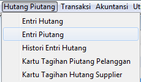

##Hutang (_Account Payable_)

Hutang dapat terjadi karena beberapa antara lain karena pembelian maupun pinjaman uang. Dalam sistem ini terdapat beberapa entri yang dapat
menimbulkan hutang antara lain :

1. Hutang yang timbul dari Menu [Transaksi -- > Pembelian --> Pembelian]
2. Hutang yang timbul dari Menu [Transaksi --> Penjualan --> Retur Penjualan]
3. Hutang yang timbul dari Menu [Hutang-Piutang --> Entry Hutang]
4. Hutang yang timbul dari Menu [Transaksi --> Pembelian --> Saldo Awal Hutang Pembelian]

Hutang yang timbul akibat pembelian maupun retur penjualan mempunyai hubungan dengan persediaan barang. Kedua menu ini sudah dibahas pada
Bab-bab sebelumnya, pada Bab ini kita akan membahas hanya Hutang pada poin 3 dan 4.

###Entri Hutang

Hutang yang perlu dientry pada Entry Hutang adalah hutang yang tidak berhubungan dengan pembelian persediaan barang maupun retur penjualan
persediaan barang. Hutang yang perlu dientry pada Entry Hutang adalah hutang yang timbul akibat pinjaman uang dari pihak lain baik untuk
keperluan penambahan saldo Kas Bank maupun untuk pembelian barang inventaris yang tidak termasuk barang persediaan (stok).

_**Bagian Header**_

1. Dari menu utama klik menu Hutang Piutang --> Entry Hutang

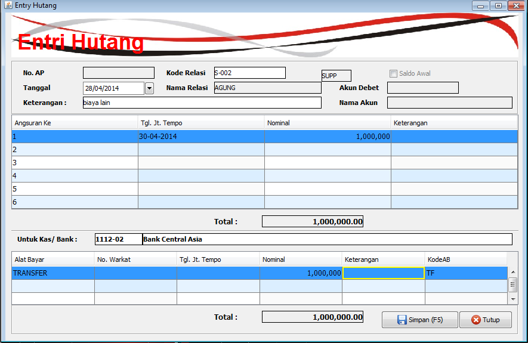

2. Nomor AP secara otomatis akan dibuatkan oleh sistem secara unik.
3. Masukkan kode relasi yang merupakan gabungan dari Master Supplier dan Customer
3. Checkbox Saldo Awal berfungsi untuk menandakan bahwa data A/P yang sedang dientry merupakan Saldo Awal Hutang atau bukan. Jika data ini merupakan saldo awal hutang, maka aktifkan
(check) checkbox Saldo Awal. Perhatikan bahwa dengan mencheck Saldo Awal, Anda harus mengisi Akun Debet dan tidak perlu mengisi data tentang Bank dan Alat Bayar yang diterima.
4. Akun Debet merupakan combobox untuk menampilkan dropdown daftar akun di COA. Akun Debet hanya perlu diisi jika checkbox Saldo Awal di check. Nama Akun akan muncul secara otomatis
jika Akun Debet diisi.
5. Keterangan merupakan textbox yang bebas Anda entry sebagai penjelasan untuk entry A/P yang sedang dimasukkan.

_**Bagian Detail Angsuran A/P**_

6. Kolom Angsuran Ke merupakan nomor urut yang tidak dapat diedit oleh pemakai. Nomor urut ini hanya merupakan nomor urut angsuran. Jika data Hutang (A/P) yang dientry bukan merupakan
data angsuran (tidak dibayar secara berangsur), maka cukup mengisikan Angsuran Ke 1 saja.
7. Tanggal Jatuh Tempo merupakan data tanggal yang dapat diisi maupun dipilih dari dropdown kalender yang tersedia. 
Tanggal ini merupakan tanggal jatuh tempo untuk masing-masing data angsuran. Tanggal Jatuh Tempo tidak boleh lebih kecil dari Tanggal A/P.
8. Kolom Nominal merupakan nominal hutang (per angsuran). Isilah Nominal dan lanjutkan ke kolom berikutnya. Jika data hutang ini terdiri dari berapa angsuran, 
maka total nominal akan ditampilkan pada bagian bawah grid (tepat dibawah kolom Nominal).
9. Keterangan (detail) merupakan keterangan tambahan yang dapat Anda berikan pada tiap baris data angsuran.
10. Ulangi langkah 6 s/d 11 untuk semua detail (angsuran) Hutang

_**Bagian Kas Bank & Grid Alat Bayar**_

Bagian ini hanya perlu (dapat) dientry jika checkbox Saldo Awal tidak diisi atau data Hutang ini bukan data saldo awal Hutang.

11. Untuk Kas / Bank (Kode Kas Bank) merupakan combobox yang dapat diisi maupun dipilih dari dropdown daftar Kas Bank. 
Nama Kas Bank akan muncul secara otomatis setelah Kode Kas Bank terisi.
12. Kolom Alat Bayar adalah combobox dengan dropdown daftar alat bayar yang dapat dipergunakan (telah didefenisikan pada Master Alat Bayar).
13. Nomor Warkat merupakan textbox yang dapat Anda isi dengan nomor Cheque, Giro atau Nomor lainnya yang berhubung dengan Alat Bayar. 
Untuk pembayaran tunai, No. Warkat tidak perlu diisi.
14. Tanggal Jatuh Tempo dalam grid ini merupakan tanggal jatuh tempo warkat yang terima, terutama warkat yang tidak langsung
cair (lihat Bab mengenai Master Alat Bayar). Warkat-warkat tersebut misalnya adalah Cheque dan Giro yang memerlukan proses pencairan.
15. Nominal merupakan jumlah / nilai alat bayar (warkat) yang diterima. Pada bagian bawah grid, tepatnya dibawah kolom Nominal terdapat Total Nominal 
yang dijumlahkan dari baris-baris Nominal yang terisi. Jumlah Total pada Grid (Alat Bayar) ini harus sama dengan Total pada Grid (Angsuran) sebelumnya.
16. Ulangi langkah 12 s/d 15 untuk semua detail (alat bayar) pinjaman Hutang
17. Setelah keseluruhan data satu No. A/P (Hutang) selesai dientry, langkah berikutnya adalah menyimpan data tersebut. Sorot pada [Simpan] tekan {Enter} atau 
klik pada [Simpan] dengan mouse. Anda juga dapat mencetak data yang sudah dientry dengan klik pada [Cetak] untuk mencetak bukti penerimaan Hutang ([Cetak]
secara otomatis akan menyimpan data).

###Entri Saldo Awal Hutang Pembelian

Berbeda dari menu Enti Hutang diatas, kalau Entri Hutang diatas digunakan untuk memasukkan Hutang pada umumnya, 
akan tetapi menu Entri Saldo Awal Hutang Pembelian digunakan untuk memasukkan hanya berhubungan dengan faktur pembelian sebelum periode Januari 2014.
Atau dengan kata lain pembelian yang sudah di ada sistem lama tapi belum terbayar sampai saat ini.

Transaksi yang diakibatkan oleh entri hutang pembelian ini tidak berdampak pada penambahan stok, tapi hanya berdampak pada penambahan Hutang Supplier yang otomatis 
akan muncul di reminder hutang jatuh tempo maupun pada saat kita membuka form Pembayaran Supplier.

**Apa yang harus dipersiapkan**

1. Kode Supplier sudah harus dientri di Master Supplier
2. Akun Hutang sudah harus dientri di Master Chart of Account (COA)

Kita bisa melakukan ini dari menu Transaksi --> Pembelian --> Saldo Awal Hutang Pembelian 

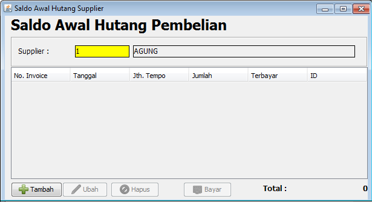

_**Bagian Header**_

1. Pertama kali form ini dibuka, maka otomatis diarahkan untuk memilih supplier yang akan ditambahkan hutangnya.
2. Tekan tombol Add untuk menambahkan saldo awal Hutang Baru.

_**Bagian Detail**_

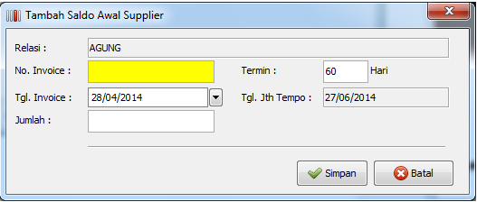

3. No. Invoice harus diisi sesuai dengan nomor faktur pembelian supplier pada saat itu. No. Invoice ini harus unik dan belum pernah dipakai sebelumnya di transaksi
pembelian
4. Termin diisi dengan jumlah hari sebagai jatuh tempo pembayaran hutang dari tanggal pembelian
5. Tanggal harus diisi sesuai tanggal faktur pembelian supplier.
6. Jumlah diisi sesuai dengan nilai total dari pembelian.
7. Tekan Simpan untuk menambahkan saldo awal hutang supplier
8. Daftar saldo awal hutang supplier akan otomatis ditampilkan di tabel daftar saldo awal hutang supplier
9. Ulangi proses 2 sampai 8 jika akan menambahkan saldo awal hutang pembelian baru.

_**Bagian Footer**_

1. Label Grand Total adalah akumulasi dari semua saldo awal hutang pembelian yang pernah dimasukkan
2. Tombol Tambah untuk menambahkan hutang baru untuk saldo awal pembelian
3. Tombol Ubah digunakan untuk mengedit atau merubah data saldo awal pembelian yang dipilih atau terseleksi ditabel detail saldo awal.
4. Tombol Hapus digunakan untuk menghapus data pembelian yang dipilih atau terseleksi ditabel detail saldo awal
5. Tombol Bayar bisa digunakan untuk melakukan pembayaran hutang supplier yang dipilih.

###Entri Piutang

Untuk sementara entri piutang yang sebelumnya ada di sistem lama kita jadikan satu dengan Entri Saldo Awal Piutang Penjualan, 
karena saya asumsikan piutang yang dimaksud adalah berhubungan dengan piutang pelanggan. Yang akan dibahas pada bab selanjutnya

###Entri Saldo Awal Pitang Penjualan

Berbeda dari menu Enti Piutang diatas, kalau Entri Piutang diatas digunakan untuk memasukkan Piutang pada umumnya, 
akan tetapi menu Entri Saldo Awal Piutang Penjualan digunakan untuk memasukkan hanya berhubungan dengan faktur penjualan sebelum periode Januari 2014.
Atau dengan kata lain penjualan yang sudah di ada sistem lama tapi belum dibayar oleh pelanggan sampai saat ini.

Transaksi yang diakibatkan oleh entri Piutang Penjualan ini tidak berdampak pada pengurangan stok, tapi hanya berdampak pada penambahan Piutang Penjualan yang otomatis 
akan muncul di reminder piutang jatuh tempo maupun pada saat kita membuka form Pembayaran / Penerimaan Pelanggan.

**Apa yang harus dipersiapkan**

1. Kode Pelanggan sudah harus dientri di Master Pelanggan
2. Akun Piutang sudah harus dientri di Master Chart of Account (COA)

Kita bisa melakukan ini dari menu Transaksi --> Penjualan --> Saldo Awal Piutang Penjualan

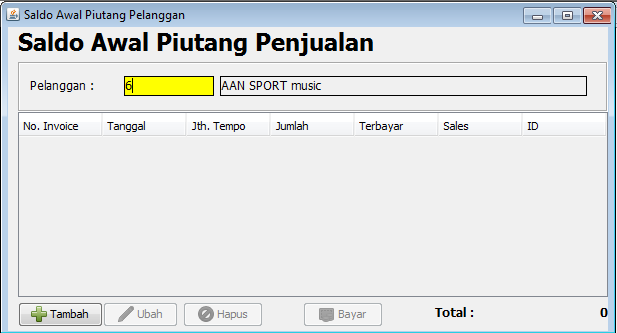

_**Bagian Header**_

1. Pertama kali form ini dibuka, maka otomatis diarahkan untuk memilih pelanggan yang akan ditambahkan hutangnya.
2. Tekan tombol Add untuk menambahkan saldo awal piutang baru.

_**Bagian Detail**_

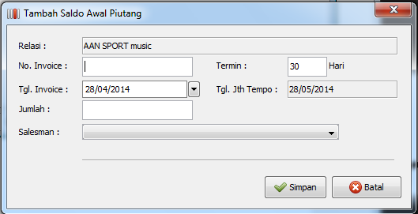

3. No. Invoice harus diisi sesuai dengan nomor faktur penjualan pada saat itu. No. Invoice ini harus unik dan belum pernah dipakai sebelumnya di transaksi penjualan
4. Termin diisi dengan jumlah hari sebagai jatuh tempo pembayaran piutang dari tanggal penjualan
5. Tanggal harus diisi sesuai tanggal faktur penjualan
6. Jumlah diisi sesuai dengan nilai total dari penjualan.
7. Tekan Simpan untuk menambahkan saldo awal piutang pelanggan
8. Daftar saldo awal piutang pelanggan akan otomatis ditampilkan di tabel daftar saldo awal piutang pelanggan
9. Ulangi proses 2 sampai 8 jika akan menambahkan saldo awal piutang penjualan baru.

_**Bagian Footer**_

1. Label Grand Total adalah akumulasi dari semua saldo awal piutang penjualan yang pernah dimasukkan untuk pelanggan yang bersangkutan
2. Tombol Tambah untuk menambahkan piutang baru untuk saldo awal penjualan
3. Tombol Ubah digunakan untuk mengedit atau merubah data saldo awal penjualan yang dipilih atau terseleksi ditabel detail saldo awal.
4. Tombol Hapus digunakan untuk menghapus data penjualan yang dipilih atau terseleksi ditabel detail saldo awal
5. Tombol Bayar bisa digunakan untuk melakukan pembayaran piutang pelanggan yang dipilih.

###Laporan Hutang Piutang

Untuk mempermudah kita pada sistem ini laporan hutang piutang kita pisahkan tersendiri, meskipun sumber dari akun hutang & piutang tersebut berasal dari transaksi 
pembelian maupun penjualan yang sebagian laporannya juga sudah disediakan di laporan pembelian dan laporan penjualan.

Untuk membukanya, dari menu utama klik Laporan --> Hutang Piutang, maka kita bisa lihat form parameter laporan seperti gambar berikut.

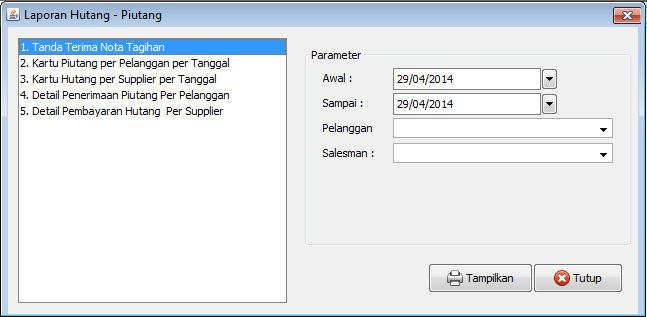

**Tanda Terima Nota Tagihan**

Laporan ini disediakan untuk menyesuaikan dengan format yang biasa digunakan oleh PT Rejeki Makmur selama ini. Untuk menampilkannya, pilih tanggal awal dan akhir dari
transaksi penjualan kemudian tekan **Tampilkan**.

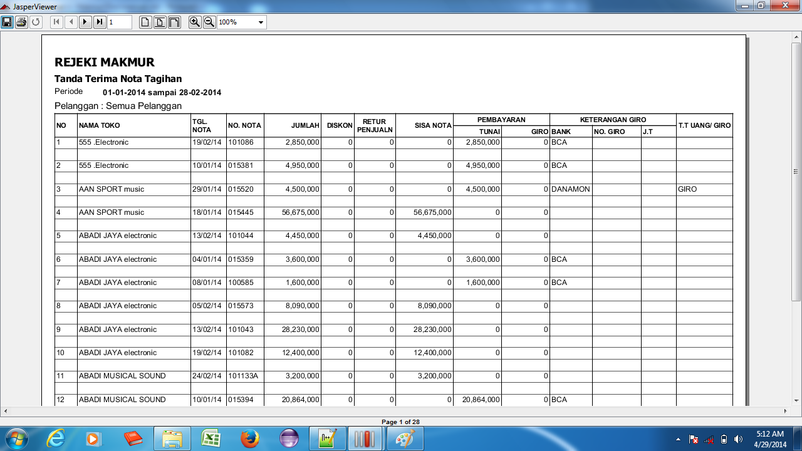

**Kartu Piutang per Pelanggan per Tanggal**

Untuk mempermudah melihat piutang per pelanggan dan pembayaran yang sudah pernah dilakukkanya, maka disediakan laporan kartu piutang per Pelanggan per Tanggal. 
Pilih tanggal awal dan akhir transaksi penjualan, kemudian pilih nama Pelanggan. Klik **Tampilkan** untuk melihat laporan tersebut

**Kartu Hutang per Supplier per Tanggal**

Pencatatan hutang per supplier dan pembayaran yang telah dilakukannya, kita bisa lihat dari pilihan laporan nomor 3. Masukkan tanggal awal dan akhir pembelian 
kemudian pilih nama supplier yang akan kita lihat. Klik **Tampilkan** untuk melihat hasil dari laporan tersebut.

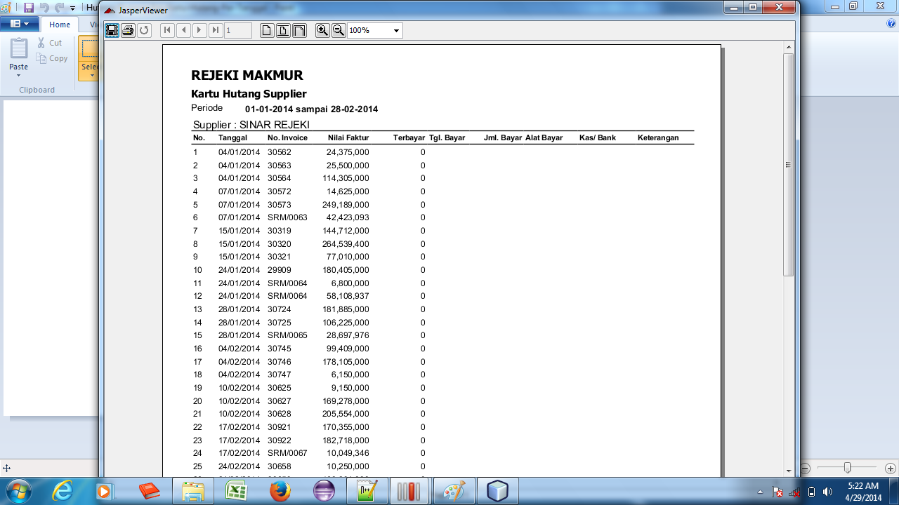

**Detail Penerimaan Piutang per Pelanggan**

Laporan penerimaan pelanggan digunakan untuk melihat detail pembayaran yang pernah dilakukan oleh satu pelanggan sesuai dengan tanggal pembayaran piutang oleh pelanggan.

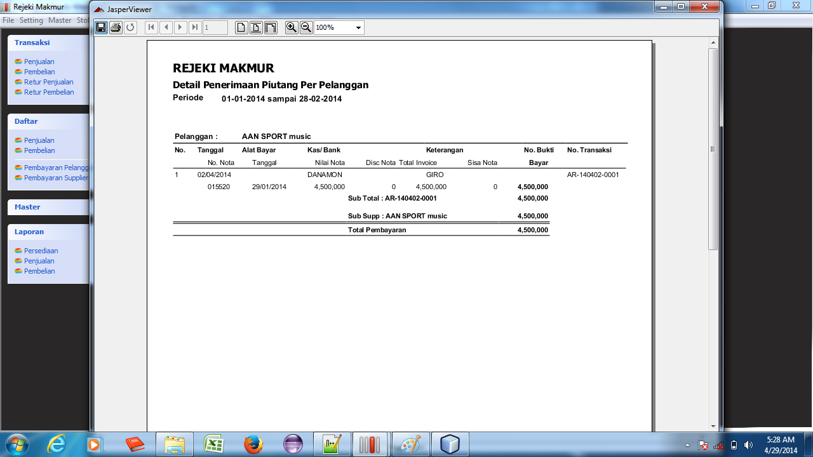

**Detail Pembayaran Hutang per Supplier**

Detail pembayaran hutang supplier bisa dilihat dari menu nomor 5. Pilih tanggal awal dan akhir pembayaran hutang supplier kemudian tekan **Tampilkan**.

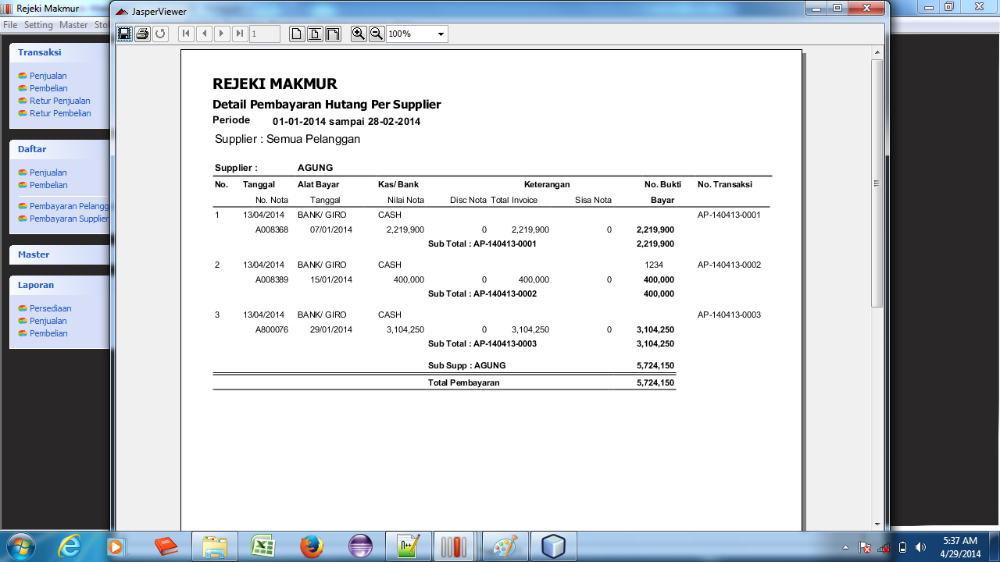

\newpage

