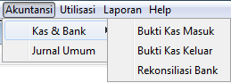
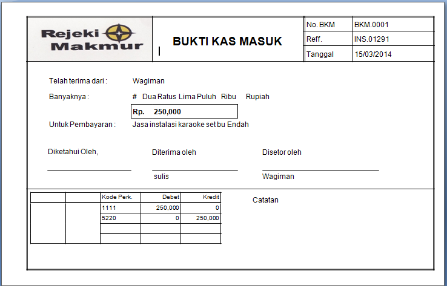

\newpage

# JURNAL UMUM & KAS BANK #

Aktifitas penerimaan dan pengeluaran kas/ bank dan yang berhubungan dengan keuangan lain kita gabung dalam menu Akuntansi seperti gambar berikut.

##Bukti Jurnal

Transaksi yang dapat dimasukkan dalam aktifitas jurnal umum ini adalah transaksi yang tidak dapat dimasukkan dari menu-menu lainnya. Segala transaksi penjualan sudah 
ditampung dalam modul penjualan, begitu pula dengan transaksi pembelian sudah dimasukkan dalam modul pembelian.

Penyesuaian terhadap barang dan mutasi barang telah dikelompokkan di modul *inventory*. Transaksi perbankan seperti pembayaran, penerimaan dan rekonsiliasi bank telah 
dimasukkan dalam modul kas & bank.

Beberapa transaksi yang dapat dimasukkan di dalam jurnal umum adalah

1. Setoran tunai ke bank
2. Ambilan Tunai dari bank
3. Transfer dana antar bank
4. Penyesuaian atas pendapatan dan biaya
5. Proses _period end_ yang dibuatkan jurnal secara otomatis
6. Transaksi koreksi dan penyesuaian lainnya.

Untuk membuka jurnal umum ini, dari menu utama klik menu Akuntansi --> Jurnal umum, maka kita bisa melihat form jurnal umum seperti gambar berikut.

_**Bagian Header**_

1. Masukkan nomor bukti jurnal umum dengan kode unik yang belum pernah dipakai sebelumnya. Kode tersebut bisa kita masukkan sesuai dengan format yang ada saat ini.
2. Pilih tanggal transaksi jurnal
3. Masukkan keterangan untuk memperjelas transaksi jurnal ini dan supaya mudah dilihat oleh rekan sesama di perusahaan.

_**Bagian Detail**_

4. Pada bagian detail, kita bisa menambahkan daftar akun dengan menekan tombol **Insert** di _keyboard_, maka akan muncul form lookup akun seprti gambar berikut.
5. Setelah akun ditambahkan ke tabel, kemudian masukkan jumlah Debet jika akun tersebut jumlahnya bertambah, sedangkan jika jumlahnya mengurangi akun, maka tambah
nilai di kolom Credit.
6. Ulangi proses 4 sampai 5 untuk memasukkan item-item yang lain.

_**Bagian Footer**_

7. Pada bagian footer terdapat label Total Debet dan Total Kredit sebagai akumulasi dari total debet dan kredit didalam tabel transaksi
8. Total Debet dan Kredit harus sama, kalau tidak maka transaksi tidak bisa disimpan.
9. Button atau tombol proses simpan **Hapus**, **Simpan** terdapat dibagian footer.

##Bukti Kas Masuk

Aktifitas ini berguna sebagai penerimaan uang selain dari penjualan barang/ jasa, bukan dari pembayaran piutang dari pelanggan dan bukan pula ambilan
dari kas/ bank perusahaan sendiri.

Transaksi yang dapat dimasukkan adalah penerimaan kas/ bank berasal dari akun tipe selain *account receivable*, *account payable* dan akun kas/ bank itu sendiri, 
seperti penerimaan bunga oleh bank, penerimaan jasa instalasi, penerimaan uang sewa gudang yang tidak dipakai, penerimaan hadiah undangan dan lainnya.

_**Bagian Header**_

1. Deposit To diisi dengan Akun Kas/ Bank yang akan di debet (masuk)
2. Nomor Bukti diisi dengan kombinasi huruf dan angka. Misalnya BKM.0001 dan lainnya.
3. Pilih tanggal kas/ bank masuk
4. No. Reff diisi jika ada nomor bukti lain dari penyetor atau transaksi sumber.
5. Keterangan diisi dengan deskripsi penerimaan kas/ bank tersebut

_**Bagian Detail**_

6. Pada bagian detail, kita bisa menambahkan daftar akun dengan menekan tombol **Insert** di _keyboard_, maka akan muncul form lookup akun seprti gambar berikut.
7. Setelah akun ditambahkan ke tabel, kemudian masukkan Jumlah untuk item akun tersebut
8. Ulangi proses 4 sampai 5 untuk memasukkan item-item akun yang lain.

_**Bagian Footer**_

9. Pada bagian footer terdapat textbox kasir atau user yang mengentry transaksi kas/ bank tersebut.
10. Diterima oleh menunjukkan user yang menerima uang/ bukti bank masuk
11. Button atau tombol proses simpan **Hapus**, **Simpan** terdapat dibagian footer.
12. Setelah transaksi tersimpan, maka bukti kas/ bank masuk ditampilkan seperti gambar berikut.

##Bukti Kas Keluar

Aktifitas ini berguna sebagai pembayaran uang selain untuk pembelian barang/ jasa, bukan untuk pembayaran utang pada pemasok dan bukan pula setoran ke kas/ bank sendiri.

Transaksi yang dapat dimasukkan adalah pembayaran untuk akun dengan tipe selain _account receivable_, 
_account payable_ dan _account cash/ bank_ itu sendiri, seperti pembayaran biaya-biaya, utang lancar lainnya, pembelian harta lancar lainnya, membayaran dan lainnya.

_**Bagian Header**_

1. Paid From diisi dengan Akun Kas/ Bank yang akan di kurangi. Bukti kas/ bank dibayar dari akun apa.
2. Nomor Bukti diisi dengan kombinasi huruf dan angka. Misalnya BKK.0001 dan lainnya.
3. Pilih tanggal kas/ bank keluar
4. No. Reff diisi jika ada nomor bukti lain dari toko atau transaksi sumber.
5. Keterangan diisi dengan deskripsi pembayaran kas/ bank tersebut

_**Bagian Detail**_

6. Pada bagian detail, kita bisa menambahkan daftar akun dengan menekan tombol **Insert** di _keyboard_, maka akan muncul form lookup akun seprti gambar berikut.
7. Setelah akun ditambahkan ke tabel, kemudian masukkan Jumlah untuk item akun tersebut
8. Ulangi proses 4 sampai 5 untuk memasukkan item-item akun yang lain.

_**Bagian Footer**_

9. Pada bagian footer terdapat textbox kasir atau user yang mengentry transaksi kas/ bank tersebut.
10. Diterima oleh menunjukkan user yang menerima uang/ bukti bank keluar
11. Button atau tombol proses simpan **Hapus**, **Simpan** terdapat dibagian footer.
12. Setelah transaksi tersimpan, maka bukti kas/ bank masuk ditampilkan seperti gambar berikut.

##History Kas Masuk/ Keluar

Semua transaksi kas/ bank yang sudah pernah dibuat bisa dilihat kembali dari form histori kas/ bank. Dari menu Daftar --> Kas & Bank --> Bukti Kas/ Bank Masuk. 
Maka form tersebut akan ditampilkan seperti gambar berikut.

##Buku Bank

Seluruh transaksi yang mengakibatkan perubahan terhadap saldo akun kas/ bank akan dicatat dalam sebuah buku untuk setiap masing-masing akun tersebut.
Buku tersebut dinamakan dengan Buku Bank.

##Rekonsiliasi Bank

Jika perusahaan menaruh uang di bank dalam bentuk giro maka setiap bulan sekali akan memperoleh laporan perubahan saldo uang di bank yang bersangkutan selama 
periode bulanan tersebut. Laporan tersebut dikenal dengan rekening koran.

Dari rekening koran tersebut kita dapat mengetahui berapa bunga yang diperoleh, potongan biaya administrasi bank, cek yang telah dikeluarkan oleh perusahaan
tetapi belum dicairkan oleh pemegang cek (pemasok) yang dikenal dengan istilah cek dalam peredaran (_outstanding cheque_).

Selain itu kita juga bisa mengetahui giro mana saja yang sudah kita setorkan ke bank (asalnya dari pelanggan) yang sampai laporan rekening koran diterima perusahaan
belum ditampilkan. Hal ini dikenal dengan istilah Setoran Dalam Proses.

Dari menu utama, klik menu Akuntansi --> Kas & Bank --> Rekonsiliasi Bank, maka kita mendapati form tesebut seperti gambar berikut.

1. Pilih Akun Kas/ Bank pada _combobox_  Bank, kemudian pilih tanggal awal dan akhir transaksi kas/ bank yang akan direkonsiliasi, kemudian tekan **Tampilkan**.
2. Masukkan saldo rekening korang pada saat di rekonsiliasi
3. Pilih tanggal rekonsiliasi
3. Centang _checkbox_ Pilih Semua untuk memastikan semua transaksi sudah beres, atau pilih _checkbox_ Beres di tabel daftar transaksi untuk memastikan satu-satu dari 
transaksi tersebut.
4. Tekan **Simpan** untuk menyimpan rekonsiliasi bank.

##Laporan Kas/ Bank dan Buku Besar

Laporan yang berhubungan dengan aktifitas kas/ bank dan Buku Besar dapat dilihat dari menu Laporan --> Kas/ Bank & Buku Besar.

Pada form laporan tersebut dibagi menjadi dua bagian. Laporan yang berhubungan dengan aktifitas kas dan bank dikelompokkan di bagian Kas & Bank.
Berikut beberapa contoh laporan-laporan tersebut.

 

 

 

 

Laporan yang merupakan hasil akhir dari semua aktifitas transaksi suatu perusahaan dikelompokkan dibagian Buku Besar.
Dibagian laporan buku besar akan diketahui posisi keuangan perusahaan berupa neraca (harga, hutang dan modal) serta laba/rugi dalam suatu periode yang dipilih.
Terdapat beberapa laporan yang disediakan untuk buku besar ini, yang hasil laporannya antara lain sebagai berikut.

\newpage

